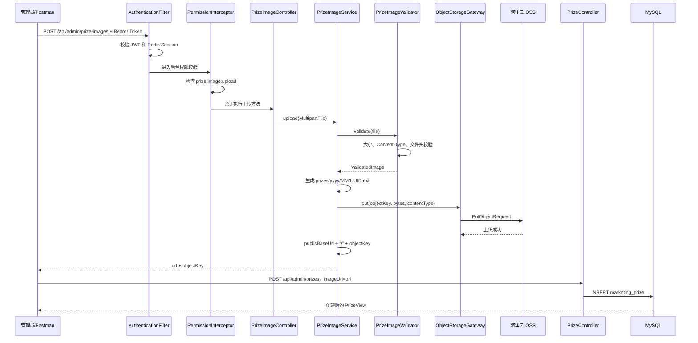
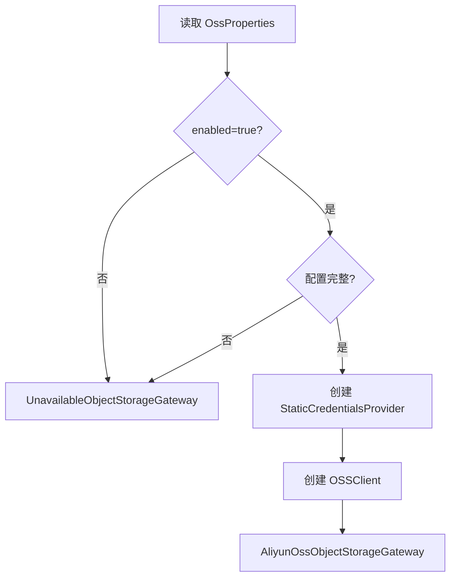

# LuckyHub OSS 图片上传实现详解

> 本文基于 LuckyHub 当前源码编写，面向正在学习 Spring Boot、文件上传、阿里云 OSS 和分层设计的开发者。
>
> 文档不仅说明“怎样调用”，还会解释一次请求从浏览器进入系统后，依次经过哪些类、为什么这样设计、公开 URL 如何产生，以及这个 URL 最终怎样保存到 MySQL。

## 1. 最终实现了什么

LuckyHub 的奖品图片采用“两步式”处理：

1. 管理员先调用图片上传接口，将图片上传到阿里云 OSS。
2. 后端返回图片的公开 URL 和 OSS Object Key。
3. 前端再调用创建奖品或修改奖品接口，把公开 URL 放进 `imageUrl`。
4. 奖品服务将公开 URL 保存到 MySQL 的 `marketing_prize.image_url`。

对应接口如下：

```text
POST /api/admin/prize-images
POST /api/admin/prizes
PUT  /api/admin/prizes/{id}
```

最重要的区别是：

```text
图片上传接口
    负责：校验图片、上传 OSS、返回公开 URL
    不负责：写入 marketing_prize

创建/修改奖品接口
    负责：把 imageUrl 保存到 marketing_prize.image_url
    不负责：接收 MultipartFile 或直接上传 OSS
```

这种设计把“二进制文件上传”和“奖品业务数据写入”分开，使前端可以先预览图片，也使奖品 JSON 接口保持简单。

---

## 2. 一次完整请求的总体流程

下面是一张从登录到数据库保存的完整流程图：



如果只执行第一段，OSS 中会存在图片，但数据库中还没有奖品记录。

如果图片上传成功后，用户没有继续创建奖品，这张图片会成为“孤立图片”。当前版本接受这种情况，没有实现自动清理任务。

---

## 3. 相关源码目录

OSS 图片上传涉及以下主要文件：

```text
src/main/java/com/dongqh/luckyhub/prize/
├─ config/
│  ├─ OssProperties.java
│  └─ OssConfiguration.java
├─ controller/
│  ├─ PrizeImageController.java
│  └─ PrizeController.java
├─ image/
│  ├─ PrizeImageValidator.java
│  ├─ PrizeImageService.java
│  └─ ValidatedImage.java
├─ storage/
│  ├─ ObjectStorageGateway.java
│  ├─ AliyunOssObjectStorageGateway.java
│  └─ UnavailableObjectStorageGateway.java
├─ vo/
│  └─ ImageUploadView.java
├─ dto/
│  ├─ CreatePrizeCommand.java
│  └─ UpdatePrizeCommand.java
├─ entity/
│  └─ MarketingPrize.java
├─ service/impl/
│  └─ PrizeServiceImpl.java
└─ enums/
   └─ PrizeErrorCode.java
```

配置和数据库文件：

```text
pom.xml
.env
.env.example
src/main/resources/application.yaml
src/main/resources/db/migration/V3__add_prize_management_permissions.sql
```

测试文件：

```text
src/test/java/com/dongqh/luckyhub/prize/
├─ controller/PrizeImageControllerTests.java
├─ image/PrizeImageValidatorTests.java
├─ image/PrizeImageServiceTests.java
└─ storage/OssConfigurationTests.java
```

---

## 4. OSS 中几个容易混淆的概念

### 4.1 Region

Region 是 Bucket 所在的地域，例如：

```text
华东1（杭州） → cn-hangzhou
华东2（上海） → cn-shanghai
华北2（北京） → cn-beijing
```

项目中的配置：

```properties
OSS_REGION=cn-hangzhou
```

OSS SDK V2 使用 Region 参与请求构建和 V4 签名。

### 4.2 Endpoint

Endpoint 是程序访问 OSS 服务的地址，不包含 Bucket 名：

```text
https://oss-cn-hangzhou.aliyuncs.com
```

配置：

```properties
OSS_ENDPOINT=https://oss-cn-hangzhou.aliyuncs.com
```

它主要用于后端 SDK 上传文件。

### 4.3 Bucket

Bucket 是存放对象的容器，例如：

```text
luckyhub-prize
```

配置：

```properties
OSS_BUCKET=luckyhub-prize
```

### 4.4 Object Key

Object Key 是文件在 Bucket 中的对象名。

LuckyHub 生成的格式：

```text
prizes/2026/07/123e4567-e89b-12d3-a456-426614174000.png
```

OSS 是扁平化对象存储，并没有真正的磁盘目录。`/` 只是 Object Key 的一部分，OSS 控制台会把它展示成目录结构。

### 4.5 Public Base URL

Public Base URL 是浏览器访问这个 Bucket 的公开根地址：

```text
https://luckyhub-prize.oss-cn-hangzhou.aliyuncs.com
```

配置：

```properties
OSS_PUBLIC_BASE_URL=https://luckyhub-prize.oss-cn-hangzhou.aliyuncs.com
```

它包含 Bucket 名，而 Endpoint 不包含：

```text
OSS_ENDPOINT
https://oss-cn-hangzhou.aliyuncs.com

OSS_PUBLIC_BASE_URL
https://luckyhub-prize.oss-cn-hangzhou.aliyuncs.com
        └─────── Bucket 名 ───────┘
```

如果以后给 OSS 绑定了自定义域名：

```text
https://img.example.com
```

只需要修改 `OSS_PUBLIC_BASE_URL`。上传使用的 Endpoint 可以保持不变。

### 4.6 AccessKey 怎样获得 Bucket 权限

AccessKey 本身不直接绑定 Bucket。

完整关系是：

```text
AccessKey ID
    ↓ 识别 RAM 用户
RAM 用户
    ↓ 关联 RAM Policy
RAM Policy
    ↓ Allow oss:PutObject 到指定资源
Bucket/prizes/*
```

程序使用 AccessKey 对请求签名。OSS 根据 AccessKey ID 找到对应的阿里云账号或 RAM 用户，然后综合判断 RAM Policy、Bucket Policy 和显式 Deny。

推荐为 LuckyHub 创建专门的 RAM 用户，并只授予：

```json
{
  "Version": "1",
  "Statement": [
    {
      "Effect": "Allow",
      "Action": [
        "oss:PutObject"
      ],
      "Resource": [
        "acs:oss:*:*:luckyhub-prize/prizes/*"
      ]
    }
  ]
}
```

不要在正式环境长期使用阿里云主账号 AccessKey，也不要给应用无必要的 `AliyunOSSFullAccess`。

---

## 5. Maven SDK 依赖

项目在 `pom.xml` 中声明：

```xml
<properties>
    <aliyun-oss-v2.version>0.5.0</aliyun-oss-v2.version>
</properties>

<dependency>
    <groupId>com.aliyun</groupId>
    <artifactId>alibabacloud-oss-v2</artifactId>
    <version>${aliyun-oss-v2.version}</version>
</dependency>
```

这里使用的是阿里云 OSS Java SDK V2。

核心使用的 SDK 类型：

```java
OSSClient
StaticCredentialsProvider
PutObjectRequest
BinaryData
```

各自作用：

| 类型 | 作用 |
|---|---|
| `OSSClient` | 执行 OSS API 请求 |
| `StaticCredentialsProvider` | 向 SDK 提供 AccessKey ID 和 Secret |
| `PutObjectRequest` | 描述一次文件上传请求 |
| `BinaryData` | 把 Java 字节数组转换成 SDK 请求体 |

阿里云官方 Java SDK V2 文档：

- <https://help.aliyun.com/zh/oss/developer-reference/oss-sdk-for-java-2-0>
- <https://help.aliyun.com/zh/oss/developer-reference/putobject>

---

## 6. 配置是怎样进入 Spring Boot 的

### 6.1 `.env`

项目根目录 `.env` 保存本地运行配置：

```properties
OSS_ENABLED=true
OSS_REGION=cn-hangzhou
OSS_ENDPOINT=https://oss-cn-hangzhou.aliyuncs.com
OSS_BUCKET=luckyhub-prize
OSS_ACCESS_KEY_ID=你的RAM用户AccessKeyID
OSS_ACCESS_KEY_SECRET=对应的AccessKeySecret
OSS_PUBLIC_BASE_URL=https://luckyhub-prize.oss-cn-hangzhou.aliyuncs.com
```

真实 `.env` 已被 `.gitignore` 忽略，不应提交到 Git。

`.env.example` 只保存字段示例，不能放真实密钥。

### 6.2 `application.yaml`

Spring Boot 通过下面的配置加载根目录 `.env`：

```yaml
spring:
  config:
    import: optional:file:.env[.properties]
```

`optional:` 表示没有 `.env` 时不会因为文件不存在直接启动失败。

OSS 配置映射如下：

```yaml
luckyhub:
  oss:
    enabled: ${OSS_ENABLED:false}
    region: ${OSS_REGION:}
    endpoint: ${OSS_ENDPOINT:}
    bucket: ${OSS_BUCKET:}
    access-key-id: ${OSS_ACCESS_KEY_ID:}
    access-key-secret: ${OSS_ACCESS_KEY_SECRET:}
    public-base-url: ${OSS_PUBLIC_BASE_URL:}
```

这里使用了 Spring Placeholder：

```text
${环境变量名:默认值}
```

例如：

```yaml
enabled: ${OSS_ENABLED:false}
```

含义是：

1. 优先读取 `OSS_ENABLED`。
2. 如果没有配置，就使用 `false`。

所以默认情况下 OSS 是关闭的，避免开发者没有配置密钥时整个应用无法启动。

### 6.3 Multipart 大小设置

```yaml
spring:
  servlet:
    multipart:
      max-file-size: 6MB
      max-request-size: 6MB
```

这里把 Web 容器接收上限设置成 6 MB，而业务规则是 5 MiB。

这样设计的目的，是让略微超过 5 MiB 的请求先进入应用，再由业务校验返回明确的 `41004`。

如果容器上限也正好等于业务上限，请求可能在进入 Controller 之前就被 Spring 拒绝，无法使用奖品模块自己的错误码。

---

## 7. `OssProperties`：类型安全的配置对象

源码：

```java
@ConfigurationProperties(prefix = "luckyhub.oss")
public record OssProperties(
        boolean enabled,
        String region,
        String endpoint,
        String bucket,
        String accessKeyId,
        String accessKeySecret,
        String publicBaseUrl
) {
}
```

Spring Boot 会完成以下映射：

```text
luckyhub.oss.enabled            → enabled
luckyhub.oss.region             → region
luckyhub.oss.endpoint           → endpoint
luckyhub.oss.bucket             → bucket
luckyhub.oss.access-key-id      → accessKeyId
luckyhub.oss.access-key-secret  → accessKeySecret
luckyhub.oss.public-base-url    → publicBaseUrl
```

使用 record 的好处：

- 配置对象不可变；
- 自动拥有同名访问方法；
- 不需要手写 getter/setter；
- 构造完成后字段不能被业务代码意外修改。

### 7.1 完整性检查

```java
public boolean isComplete() {
    return StringUtils.hasText(region)
            && StringUtils.hasText(endpoint)
            && StringUtils.hasText(bucket)
            && StringUtils.hasText(accessKeyId)
            && StringUtils.hasText(accessKeySecret)
            && StringUtils.hasText(publicBaseUrl);
}
```

只有六个核心值都非空，才认为 OSS 配置完整。

例如：

```text
OSS_ENABLED=true
OSS_BUCKET=
```

即使启用了 OSS，因为 Bucket 为空，仍然会被认为配置不可用。

### 7.2 规范化公开地址

```java
public String normalizedPublicBaseUrl() {
    if (!StringUtils.hasText(publicBaseUrl)) {
        return "";
    }
    return publicBaseUrl.trim().replaceAll("/+$", "");
}
```

假设用户填写：

```text
https://bucket.example.com///
```

规范化结果：

```text
https://bucket.example.com
```

这样后面拼接：

```java
baseUrl + "/" + objectKey
```

不会产生：

```text
https://bucket.example.com////prizes/...
```

---

## 8. `OssConfiguration`：应用启动时选择真实或不可用网关

类定义：

```java
@Configuration(proxyBeanMethods = false)
@EnableConfigurationProperties(OssProperties.class)
public class OssConfiguration {
}
```

`@EnableConfigurationProperties` 让 Spring 创建并绑定 `OssProperties`。

核心 Bean：

```java
@Bean
public ObjectStorageGateway objectStorageGateway(OssProperties properties) {
    if (!properties.enabled() || !properties.isComplete()) {
        return new UnavailableObjectStorageGateway();
    }

    OSSClient client = OSSClient.newBuilder()
            .region(properties.region())
            .endpoint(properties.endpoint())
            .credentialsProvider(new StaticCredentialsProvider(
                    properties.accessKeyId(),
                    properties.accessKeySecret()
            ))
            .build();

    return new AliyunOssObjectStorageGateway(client, properties.bucket());
}
```

启动时存在两条路径：



### 8.1 为什么不在配置缺失时阻止应用启动

如果没有 OSS 配置就让 Spring 启动失败，那么：

- 登录接口不能测试；
- 奖品查询不能使用；
- 数据库和 Redis 测试也会被 OSS 阻断；
- 新开发者必须先拥有阿里云密钥才能启动项目。

当前设计选择“功能降级”：

```text
OSS 未配置
    应用可以启动
    非图片功能可以使用
    真正上传图片时返回 51002
```

---

## 9. `ObjectStorageGateway`：为什么不让 Service 直接依赖 OSS SDK

接口：

```java
public interface ObjectStorageGateway extends AutoCloseable {

    void put(String objectKey, byte[] content, String contentType);

    @Override
    default void close() throws Exception {
    }
}
```

业务层只知道：

```text
给我 Object Key、文件内容、Content-Type
我负责把它放进对象存储
```

业务层不知道：

- 使用的是阿里云 OSS；
- SDK 的 Builder 怎样调用；
- Bucket 参数怎样放入请求；
- SDK 异常类型是什么。

这叫“依赖抽象，而不是依赖具体实现”。

优点：

1. 单元测试可以使用内存 Fake Gateway，不访问真实 OSS。
2. 将来可以替换成腾讯云 COS、AWS S3 或 MinIO。
3. OSS SDK 升级只影响 storage 包。
4. 业务代码不会充满云厂商 API。

`AutoCloseable` 用于在 Spring 容器关闭时释放 `OSSClient` 持有的网络资源。

---

## 10. `AliyunOssObjectStorageGateway`：真正执行 PutObject

构造函数接收：

```java
private final OSSClient client;
private final String bucket;
```

调用上传时，先构建请求：

```java
PutObjectRequest request = PutObjectRequest.newBuilder()
        .bucket(bucket)
        .key(objectKey)
        .contentType(contentType)
        .body(BinaryData.fromBytes(content))
        .build();
```

逐项解释：

### 10.1 `.bucket(bucket)`

指定上传到哪个 Bucket：

```text
luckyhub-prize
```

### 10.2 `.key(objectKey)`

指定对象名：

```text
prizes/2026/07/UUID.png
```

### 10.3 `.contentType(contentType)`

把经过后端校验的媒体类型写入 OSS 对象元数据：

```text
image/jpeg
image/png
image/webp
```

浏览器访问图片时，OSS 会通过 HTTP `Content-Type` 响应头告诉浏览器怎样处理内容。

### 10.4 `.body(BinaryData.fromBytes(content))`

把 Java `byte[]` 包装成 SDK 能发送的请求体。

### 10.5 执行上传

```java
try {
    client.putObject(request);
} catch (RuntimeException exception) {
    throw new BusinessException(PrizeErrorCode.OSS_UPLOAD_FAILED);
}
```

真正的网络请求发生在：

```java
client.putObject(request);
```

SDK 会完成：

1. 根据 Endpoint 和 Bucket 构造请求地址；
2. 使用 AccessKey ID 定位身份；
3. 使用 AccessKey Secret 对请求进行签名；
4. 发送 HTTP PUT 请求；
5. OSS 校验签名和 RAM/Bucket 权限；
6. OSS 保存对象；
7. SDK 返回结果或抛出异常。

项目不会把阿里云 SDK 异常直接返回给前端，而是统一转换为：

```text
错误码：51001
HTTP：502 Bad Gateway
消息：奖品图片上传失败
```

这样可以避免把内部 Bucket、签名或 SDK 细节暴露给调用者。

当前实现的一个限制是：所有 OSS RuntimeException 都映射为同一个 `51001`。因此 Endpoint 错误、AccessKey 错误、权限不足和网络失败对客户端表现相同，需要结合服务器日志和阿里云控制台排查。

---

## 11. `UnavailableObjectStorageGateway`：配置不可用时怎样失败

源码：

```java
public final class UnavailableObjectStorageGateway
        implements ObjectStorageGateway {

    @Override
    public void put(
            String objectKey,
            byte[] content,
            String contentType
    ) {
        throw new BusinessException(
                PrizeErrorCode.OSS_CONFIG_UNAVAILABLE
        );
    }
}
```

当以下任一情况发生：

```text
OSS_ENABLED=false
Region 为空
Endpoint 为空
Bucket 为空
AccessKey ID 为空
AccessKey Secret 为空
Public Base URL 为空
```

上传会返回：

```text
错误码：51002
HTTP：503 Service Unavailable
消息：对象存储尚未配置
```

---

## 12. `PrizeImageController`：HTTP 上传入口

类级路径：

```java
@RestController
@RequestMapping("/api/admin/prize-images")
public class PrizeImageController {
}
```

方法：

```java
@PostMapping(consumes = MediaType.MULTIPART_FORM_DATA_VALUE)
@ResponseStatus(HttpStatus.CREATED)
@Operation(summary = "上传奖品图片")
@RequirePermission(PermissionCodes.PRIZE_IMAGE_UPLOAD)
public ApiResponse<ImageUploadView> upload(
        @RequestPart("file") MultipartFile file
) {
    return ApiResponse.success(service.upload(file));
}
```

### 12.1 为什么使用 multipart/form-data

JSON 适合传输结构化文本：

```json
{
  "prizeName": "咖啡券"
}
```

图片是二进制数据，更适合使用：

```text
multipart/form-data
```

请求示意：

```http
POST /api/admin/prize-images
Authorization: Bearer eyJ...
Content-Type: multipart/form-data; boundary=...

--boundary
Content-Disposition: form-data; name="file"; filename="prize.png"
Content-Type: image/png

<图片二进制>
--boundary--
```

### 12.2 `@RequestPart("file")`

它要求 multipart 字段名必须为：

```text
file
```

如果 Postman 中写成：

```text
image
picture
upload
```

Spring 无法绑定到该参数。

### 12.3 `201 Created`

图片成功上传后使用 HTTP 201，表示服务端成功创建了一个新的 OSS Object。

### 12.4 权限校验

```java
@RequirePermission(PermissionCodes.PRIZE_IMAGE_UPLOAD)
```

对应权限编码：

```text
prize:image:upload
```

请求在执行 Controller 之前已经经过：

```text
AuthenticationFilter
    ↓ 检查 Bearer Token、JWT、Redis Session
PermissionInterceptor
    ↓ 检查 prize:image:upload
PrizeImageController
```

没有 Token 返回 401，没有权限返回 403。

---

## 13. 奖品图片权限如何初始化

Flyway V3 创建五个奖品权限，其中图片上传权限为：

```sql
SELECT 'prize:image:upload', '上传奖品图片'
```

然后通过业务编码找到 `ADMIN`：

```sql
WHERE admin_role.role_code = 'ADMIN'
```

再把五个奖品权限关联给管理员角色。

迁移没有假设固定 `role_id` 或 `permission_id`，而是按：

```text
role_code
permission_code
```

查询每个环境里的真实自增 ID。

如果升级后旧管理员仍然返回 403，可能是 Redis 中存在旧权限缓存。权限缓存 TTL 为 10 分钟，缓存过期后会重新查询数据库。

---

## 14. `PrizeImageValidator`：为什么不能只检查扩展名

用户把文件命名成：

```text
3.png
```

并不能证明它真的是 PNG。

扩展名只是文件名的一部分，下面操作不会转换图片：

```text
3.webp → 重命名 → 3.png
```

攻击者也可能把脚本、HTML 或其他内容改名成 `.png`。

所以当前校验同时检查：

1. 文件是否为空；
2. 文件大小；
3. 客户端声明的 Content-Type；
4. 文件真实 Magic Bytes；
5. 声明类型与真实类型是否一致。

### 14.1 空文件校验

```java
if (file == null || file.isEmpty()) {
    throw new BusinessException(
            PrizeErrorCode.IMAGE_EMPTY
    );
}
```

返回：

```text
41002 图片为空
```

### 14.2 文件大小校验

```java
static final long MAX_IMAGE_BYTES =
        5L * 1024 * 1024;
```

这表示：

```text
5 × 1024 × 1024 = 5,242,880 字节
```

代码在读取前后检查两次：

```java
if (file.getSize() > MAX_IMAGE_BYTES) {
    // 41004
}

byte[] content = file.getBytes();

if (content.length > MAX_IMAGE_BYTES) {
    // 41004
}
```

第一次用 MultipartFile 元数据快速拒绝，第二次用真实读取到的字节数做防御性检查。

### 14.3 JPEG 文件头

```java
FF D8 FF
```

检测代码：

```java
if (startsWith(
        content,
        new byte[]{
            (byte) 0xFF,
            (byte) 0xD8,
            (byte) 0xFF
        }
)) {
    return ImageFormat.JPEG;
}
```

### 14.4 PNG 文件头

```java
89 50 4E 47 0D 0A 1A 0A
```

检测代码：

```java
if (startsWith(content, new byte[]{
        (byte) 0x89,
        0x50,
        0x4E,
        0x47,
        0x0D,
        0x0A,
        0x1A,
        0x0A
})) {
    return ImageFormat.PNG;
}
```

### 14.5 WebP 文件头

WebP 是 RIFF 容器格式：

```text
字节 0～3：RIFF
字节 8～11：WEBP
```

十六进制：

```text
52 49 46 46 .... .... 57 45 42 50
```

检测代码：

```java
if (content.length >= 12
        && Arrays.equals(
                Arrays.copyOfRange(content, 0, 4),
                new byte[]{'R', 'I', 'F', 'F'}
        )
        && Arrays.equals(
                Arrays.copyOfRange(content, 8, 12),
                new byte[]{'W', 'E', 'B', 'P'}
        )) {
    return ImageFormat.WEBP;
}
```

### 14.6 声明类型与真实类型必须一致

```java
ImageFormat format = detect(content);

if (format == null
        || !format.contentType.equals(
                file.getContentType()
        )) {
    throw new BusinessException(
            PrizeErrorCode.IMAGE_TYPE_UNSUPPORTED
    );
}
```

例如：

```text
请求声明：image/png
文件头识别：image/webp
结果：41003
```

这正是 `D:\3.png` 的实际情况。

它虽然叫 `3.png`，但文件头是：

```text
52 49 46 46 16 E9 00 00 57 45 42 50
```

所以真实格式是 WebP。正确做法有两个：

1. 按 WebP 上传，声明 `image/webp`；
2. 使用图片软件真正转码为 PNG。

仅修改扩展名不能改变真实格式。

### 14.7 `ImageFormat`

内部枚举把三项信息绑定在一起：

```java
private enum ImageFormat {
    JPEG("image/jpeg", "jpg"),
    PNG("image/png", "png"),
    WEBP("image/webp", "webp");
}
```

验证通过后，后续代码使用后端识别出的扩展名，而不是直接信任原文件名。

例如用户上传：

```text
my-prize.final.VERSION.PNG
```

只要真实内容和 `Content-Type` 是 PNG，最终 OSS Key 仍使用统一的小写：

```text
UUID.png
```

---

## 15. `ValidatedImage`：校验后的可信数据

```java
public record ValidatedImage(
        byte[] content,
        String contentType,
        String extension
) {
}
```

它表示一张已经通过验证的图片：

```text
content      → 真实文件字节
contentType  → 后端确认的媒体类型
extension    → 后端确认的扩展名
```

`PrizeImageService` 不再读取客户端原始文件名，也不再自己猜格式。

数据流：

```text
不可信 MultipartFile
    ↓ PrizeImageValidator
可信 ValidatedImage
    ↓ PrizeImageService
OSS 上传参数
```

---

## 16. `PrizeImageService`：编排整个上传用例

服务依赖：

```java
private final PrizeImageValidator validator;
private final ObjectStorageGateway gateway;
private final OssProperties properties;
private final Clock clock;
private final Supplier<UUID> uuidSupplier;
```

职责分别是：

| 依赖 | 职责 |
|---|---|
| `validator` | 校验图片并识别真实格式 |
| `gateway` | 把对象上传到存储服务 |
| `properties` | 提供公开访问根地址 |
| `clock` | 提供当前日期 |
| `uuidSupplier` | 生成不会轻易冲突的对象名 |

### 16.1 生产构造函数

```java
@Autowired
public PrizeImageService(
        PrizeImageValidator validator,
        ObjectStorageGateway gateway,
        OssProperties properties
) {
    this(
            validator,
            gateway,
            properties,
            Clock.systemUTC(),
            UUID::randomUUID
    );
}
```

生产环境使用：

```text
UTC 时钟
随机 UUID
```

使用 UTC 意味着在中国时间午夜附近，Object Key 中的日期可能仍是 UTC 的前一天。这不影响访问，只影响目录日期的展示。如果业务要求严格按中国日期分类，可以把时钟改成 `Asia/Shanghai`。

### 16.2 为什么 Clock 和 UUID Supplier 可以注入

如果测试直接使用：

```java
LocalDate.now()
UUID.randomUUID()
```

测试结果每次都不同，很难断言完整 Object Key。

当前设计允许测试传入：

```text
固定时间：2026-07-27
固定 UUID：123e4567-e89b-12d3-a456-426614174000
```

这样测试可以精确断言：

```text
prizes/2026/07/123e4567-e89b-12d3-a456-426614174000.png
```

### 16.3 上传方法逐行解析

第一步，验证：

```java
ValidatedImage image =
        validator.validate(file);
```

第二步，生成 Object Key：

```java
String objectKey =
        "prizes/%s/%s.%s".formatted(
                LocalDate.now(clock)
                        .format(PATH_DATE),
                uuidSupplier.get(),
                image.extension()
        );
```

假设：

```text
日期：2026-07-27
UUID：123e4567-e89b-12d3-a456-426614174000
格式：PNG
```

生成：

```text
prizes/2026/07/123e4567-e89b-12d3-a456-426614174000.png
```

第三步，上传：

```java
gateway.put(
        objectKey,
        image.content(),
        image.contentType()
);
```

第四步，拼接公开 URL：

```java
String url =
        properties.normalizedPublicBaseUrl()
                + "/"
                + objectKey;
```

假设：

```text
Public Base URL:
https://luckyhub-prize.oss-cn-hangzhou.aliyuncs.com

Object Key:
prizes/2026/07/abc.png
```

得到：

```text
https://luckyhub-prize.oss-cn-hangzhou.aliyuncs.com/prizes/2026/07/abc.png
```

第五步，返回：

```java
return new ImageUploadView(url, objectKey);
```

---

## 17. `ImageUploadView` 和成功响应

```java
public record ImageUploadView(
        String url,
        String objectKey
) {
}
```

成功响应：

```json
{
  "code": 0,
  "message": "success",
  "data": {
    "url": "https://luckyhub-prize.oss-cn-hangzhou.aliyuncs.com/prizes/2026/07/abc.png",
    "objectKey": "prizes/2026/07/abc.png"
  }
}
```

两个字段用途不同：

| 字段 | 用途 |
|---|---|
| `url` | 前端展示图片、保存到奖品表 |
| `objectKey` | 将来删除、迁移、审计 OSS 对象时使用 |

当前数据库只保存公开 URL，没有单独保存 Object Key。

如果将来需要删除旧图，建议在数据库中同时保存 Object Key，或者可靠地从 URL 解析 Object Key。

---

## 18. 公开 URL 怎样保存到数据库

上传成功后，前端拿到：

```json
{
  "url": "https://.../prizes/2026/07/abc.png"
}
```

然后调用创建奖品接口：

```http
POST /api/admin/prizes
Authorization: Bearer <token>
Content-Type: application/json
```

请求：

```json
{
  "prizeName": "一等奖咖啡券",
  "prizeType": "COUPON",
  "prizeLevel": "FIRST",
  "imageUrl": "https://luckyhub-prize.oss-cn-hangzhou.aliyuncs.com/prizes/2026/07/abc.png",
  "description": "可以兑换一杯咖啡",
  "stackable": false
}
```

DTO 对 URL 的限制：

```java
@Size(
    max = 500,
    message = "奖品图片地址不能超过500个字符"
)
String imageUrl
```

服务映射：

```java
prize.setImageUrl(normalize(imageUrl));
```

空白字符串会被转换成 `null`：

```java
private String normalize(String value) {
    return StringUtils.hasText(value)
            ? value.trim()
            : null;
}
```

实体字段：

```java
private String imageUrl;
```

MyBatis-Plus 根据驼峰映射：

```text
imageUrl → image_url
```

数据库列：

```sql
image_url VARCHAR(500) NULL COMMENT '图片地址'
```

最终数据示例：

```text
marketing_prize
┌────┬────────────────┬──────────────────────────────────────────────┐
│ id │ prize_name     │ image_url                                    │
├────┼────────────────┼──────────────────────────────────────────────┤
│ 1  │ 一等奖咖啡券   │ https://.../prizes/2026/07/abc.png           │
└────┴────────────────┴──────────────────────────────────────────────┘
```

修改奖品时流程相同：

```http
PUT /api/admin/prizes/{id}
```

把新上传图片的 URL 放进 `imageUrl`，`updateById` 会更新数据库。

当前版本不会自动删除 OSS 中的旧图片。

---

## 19. 为什么上传和创建奖品不是一个事务

数据库事务只能可靠控制 MySQL：

```java
@Transactional
public PrizeView create(...) {
    mapper.insert(prize);
}
```

阿里云 OSS 是外部服务，普通 MySQL 事务不能回滚已经成功的 OSS PutObject。

可能出现：

```text
OSS 上传成功
    ↓
用户关闭页面
    ↓
没有创建奖品
    ↓
OSS 留下一张孤立图片
```

当前实现接受这个结果，换取流程简单。

将来的改进方式包括：

1. 保存图片上传记录和状态；
2. 创建奖品后把图片标记为已引用；
3. 定时删除超过一定时间仍未引用的对象；
4. 使用消息队列异步清理旧图；
5. 保存 Object Key，避免依赖 URL 解析。

---

## 20. 错误码怎样转换成 HTTP 响应

奖品错误码：

```java
IMAGE_EMPTY(
    41002,
    "奖品图片不能为空",
    HttpStatus.BAD_REQUEST
)

IMAGE_TYPE_UNSUPPORTED(
    41003,
    "仅支持 JPEG、PNG 和 WebP 图片",
    HttpStatus.BAD_REQUEST
)

IMAGE_TOO_LARGE(
    41004,
    "奖品图片不能超过5 MiB",
    HttpStatus.CONTENT_TOO_LARGE
)

OSS_UPLOAD_FAILED(
    51001,
    "奖品图片上传失败",
    HttpStatus.BAD_GATEWAY
)

OSS_CONFIG_UNAVAILABLE(
    51002,
    "对象存储尚未配置",
    HttpStatus.SERVICE_UNAVAILABLE
)
```

业务代码抛出：

```java
throw new BusinessException(
        PrizeErrorCode.IMAGE_TYPE_UNSUPPORTED
);
```

`GlobalExceptionHandler` 捕获：

```java
@ExceptionHandler(BusinessException.class)
public ResponseEntity<ErrorResponse>
handleBusinessException(...) {
    return build(
            exception.getErrorCode(),
            exception.getMessage(),
            request
    );
}
```

最终响应示例：

```json
{
  "code": 41003,
  "message": "仅支持 JPEG、PNG 和 WebP 图片",
  "data": null,
  "requestId": "fa773314-1a4e-49ba-bc19-cbe4bea3124c",
  "timestamp": 1785161817930
}
```

`requestId` 可以把客户端错误与服务器日志对应起来。

---

## 21. 完整调用示例

### 21.1 登录

```powershell
$loginBody = @{
    username = "admin"
    password = "你的管理员密码"
} | ConvertTo-Json

$login = Invoke-RestMethod `
    -Method Post `
    -Uri "http://localhost:8080/api/auth/login" `
    -ContentType "application/json; charset=utf-8" `
    -Body ([System.Text.Encoding]::UTF8.GetBytes(
        $loginBody
    ))

$token = $login.data.token
```

### 21.2 使用 curl 上传真实 PNG

```powershell
$imagePath = "D:\prize.png"

curl.exe -i `
  -X POST "http://localhost:8080/api/admin/prize-images" `
  -H "Authorization: Bearer $token" `
  -F "file=@$imagePath;type=image/png"
```

真实 JPEG：

```powershell
curl.exe -i `
  -X POST "http://localhost:8080/api/admin/prize-images" `
  -H "Authorization: Bearer $token" `
  -F "file=@D:\prize.jpg;type=image/jpeg"
```

真实 WebP：

```powershell
curl.exe -i `
  -X POST "http://localhost:8080/api/admin/prize-images" `
  -H "Authorization: Bearer $token" `
  -F "file=@D:\prize.webp;type=image/webp"
```

### 21.3 创建奖品

假设上传返回：

```text
https://luckyhub-prize.oss-cn-hangzhou.aliyuncs.com/prizes/2026/07/abc.png
```

PowerShell：

```powershell
$prizeBody = @{
    prizeName  = "一等奖咖啡券"
    prizeType  = "COUPON"
    prizeLevel = "FIRST"
    imageUrl   = "https://luckyhub-prize.oss-cn-hangzhou.aliyuncs.com/prizes/2026/07/abc.png"
    description = "可以兑换一杯咖啡"
    stackable  = $false
} | ConvertTo-Json

Invoke-RestMethod `
    -Method Post `
    -Uri "http://localhost:8080/api/admin/prizes" `
    -Headers @{
        Authorization = "Bearer $token"
    } `
    -ContentType "application/json; charset=utf-8" `
    -Body ([System.Text.Encoding]::UTF8.GetBytes(
        $prizeBody
    ))
```

### 21.4 查询并确认 URL

```powershell
$page = Invoke-RestMethod `
    -Method Get `
    -Uri "http://localhost:8080/api/admin/prizes?page=1&size=20" `
    -Headers @{
        Authorization = "Bearer $token"
    }

$page.data.records |
    Select-Object id, prizeName, imageUrl, status
```

---

## 22. 以 `D:\3.png` 为例分析失败过程

请求：

```text
文件名：3.png
请求 Content-Type：image/png
```

服务器读取前 12 个字节：

```text
52 49 46 46 16 E9 00 00 57 45 42 50
```

解析：

```text
52 49 46 46 → RIFF
57 45 42 50 → WEBP
```

所以：

```text
声明类型：image/png
真实类型：image/webp
```

执行路径：

```text
PrizeImageController.upload
    ↓
PrizeImageService.upload
    ↓
PrizeImageValidator.validate
    ↓
detect(content) 返回 WEBP
    ↓
WEBP.contentType != file.getContentType()
    ↓
BusinessException(IMAGE_TYPE_UNSUPPORTED)
    ↓
GlobalExceptionHandler
    ↓
HTTP 400 + code 41003
```

解决方式：

```powershell
Copy-Item `
  -LiteralPath "D:\3.png" `
  -Destination "D:\3.webp"

curl.exe -i `
  -X POST "http://localhost:8080/api/admin/prize-images" `
  -H "Authorization: Bearer $token" `
  -F "file=@D:\3.webp;type=image/webp"
```

或者使用画图、Photoshop、ImageMagick 等工具真正转换成 PNG。

---

## 23. 自动化测试是怎样验证实现的

### 23.1 `PrizeImageValidatorTests`

覆盖四类行为：

1. 空文件返回 `41002`；
2. 超过 5 MiB 返回 `41004`；
3. 不支持的格式或声明与文件头不一致返回 `41003`；
4. 正确识别 JPEG、PNG、WebP。

测试中的 PNG 不依赖文件扩展名，而是直接构造 PNG Magic Bytes：

```java
new byte[]{
    (byte) 0x89,
    0x50,
    0x4E,
    0x47,
    0x0D,
    0x0A,
    0x1A,
    0x0A
}
```

### 23.2 `PrizeImageServiceTests`

使用 CapturingGateway 代替真实 OSS：

```java
private static final class CapturingGateway
        implements ObjectStorageGateway {

    @Override
    public void put(
            String objectKey,
            byte[] content,
            String contentType
    ) {
        this.objectKey = objectKey;
        this.contentType = contentType;
    }
}
```

测试不会产生网络请求，但可以验证：

- Object Key 格式；
- 日期目录；
- UUID；
- 扩展名；
- Content-Type；
- 公开 URL 拼接。

### 23.3 `OssConfigurationTests`

验证两种启动状态：

```text
OSS disabled
    → UnavailableObjectStorageGateway

OSS enabled + complete
    → AliyunOssObjectStorageGateway
```

同时验证公开地址末尾 `/` 会被移除。

### 23.4 `PrizeImageControllerTests`

验证：

- 上传接口地址正确；
- 成功状态为 201；
- 响应包含 `url` 和 `objectKey`；
- 方法要求 `prize:image:upload` 权限。

这些测试没有使用真实 AccessKey，也不会上传到真实 Bucket。

真实 OSS 是否可用仍需要集成测试或人工测试确认。

---

## 24. 常见问题排查

| 现象 | 可能原因 | 检查方法 |
|---|---|---|
| `401` | Token 缺失、JWT 过期、Redis Session 不存在 | 重新登录并携带 Bearer Token |
| `403` | 用户没有 `prize:image:upload` | 检查 ADMIN 角色与权限缓存 |
| `41002` | 没有文件或文件为空 | 检查 multipart 字段 `file` |
| `41003` | 不支持的格式、Content-Type 错误、文件头不匹配 | 检查真实 Magic Bytes |
| `41004` | 图片超过 5 MiB | 压缩图片 |
| `51001` | Endpoint、Bucket、AccessKey、RAM 权限或网络错误 | 检查 OSS 配置与 RAM Policy |
| `51002` | OSS 未启用或配置缺失 | 检查 `.env` 并重启应用 |
| 上传成功但 URL 403 | Bucket 不是公共读或阻止公共访问生效 | 检查 Bucket ACL/Policy |
| OSS 有文件但数据库没有 URL | 只上传了图片，没有创建/修改奖品 | 调用奖品 JSON 接口 |

### 24.1 Netty TCP_KEEP 警告

Windows 中可能看到：

```text
Unknown channel option 'TCP_KEEPCOUNT'
Unknown channel option 'TCP_KEEPIDLE'
Unknown channel option 'TCP_KEEPINTERVAL'
```

这些通常来自 Redis/Lettuce 的 Netty 连接选项，与 OSS 图片格式校验没有直接关系。

判断真正业务错误时，应查看：

```text
Business exception
code=...
message=...
```

---

## 25. 当前实现的安全边界

已经具备：

- 后台 JWT 和 Redis Session 认证；
- `prize:image:upload` 权限校验；
- 5 MiB 业务限制；
- JPEG、PNG、WebP 白名单；
- Magic Bytes 检测；
- 声明类型与真实类型一致性检查；
- 随机 UUID Object Key；
- AccessKey 不进入 Git；
- 前端不直接接触 OSS Secret；
- 对客户端隐藏 OSS SDK 异常细节。

需要注意：

1. Bucket 只能配置“公共读”，绝不能配置“公共读写”。
2. RAM 用户应遵循最小权限原则。
3. 公共图片可能被盗链并产生流量费用，可配置防盗链或 CDN。
4. 当前没有病毒扫描或图片解码级安全验证。
5. 当前把整个文件读入内存，但因为限制为 5 MiB，风险可控。
6. 当前不自动删除旧图和孤立图。
7. 当前数据库只保存公开 URL，没有保存 Object Key。
8. 当前没有真实 OSS 自动化集成测试。

---

## 26. 可以继续改进的方向

### 26.1 兼容 `application/octet-stream`

一些 PowerShell、Swagger 或前端组件会把合法图片声明为：

```text
application/octet-stream
```

当前严格要求声明类型与真实类型完全一致，因此会返回 `41003`。

可以考虑：

```text
如果声明类型是 application/octet-stream
    仍然以 Magic Bytes 识别结果为准
否则
    要求声明类型与真实类型一致
```

安全的关键仍然是不能只相信客户端声明。

### 26.2 保存 Object Key

给 `marketing_prize` 增加：

```sql
image_object_key VARCHAR(500)
```

便于：

- 更新图片后删除旧对象；
- 审计；
- 批量迁移；
- 切换公开域名而不修改所有数据库 URL。

### 26.3 私有 Bucket

如果奖品图片不是完全公开内容，可以改成：

```text
私有 Bucket
    ↓
后端生成有时效的签名 URL
```

这时数据库更适合保存 Object Key，而不是长期公开 URL。

### 26.4 STS 前端直传

高并发、大文件场景可以让后端签发短期 STS 凭证，浏览器直接上传 OSS。

优点：

- 文件流量不经过应用服务器；
- 降低服务器带宽和内存压力。

代价：

- 权限策略和前端逻辑更复杂；
- 必须限制 STS 有效期、路径和操作；
- 需要防止客户端绕过业务约束。

当前奖品图片最大只有 5 MiB，后端代理上传更简单，也足够使用。

---

## 27. 总结

LuckyHub 的 OSS 图片上传不是一个单独的 SDK 调用，而是一条完整的受控业务链：

```text
JWT/Session 认证
    ↓
RBAC 权限校验
    ↓
MultipartFile 接收
    ↓
大小限制
    ↓
Content-Type 白名单
    ↓
Magic Bytes 识别
    ↓
生成日期 + UUID Object Key
    ↓
ObjectStorageGateway 抽象
    ↓
阿里云 PutObject
    ↓
拼接公开 URL
    ↓
前端把 URL 放入创建/修改奖品请求
    ↓
MyBatis-Plus 写入 marketing_prize.image_url
```

理解这条链路后，可以把同样的思路应用到：

- 用户头像；
- 活动封面；
- 商品图片；
- 优惠券背景；
- 中奖凭证；
- 后台富文本附件。

其中最值得复用的设计不是某一行 OSS SDK 代码，而是：

1. 配置与密钥外置；
2. 业务层依赖存储抽象；
3. 不相信文件扩展名；
4. 上传与业务数据保存分离；
5. 返回稳定 URL，同时保留 Object Key；
6. 权限、错误码和自动化测试共同约束功能。
