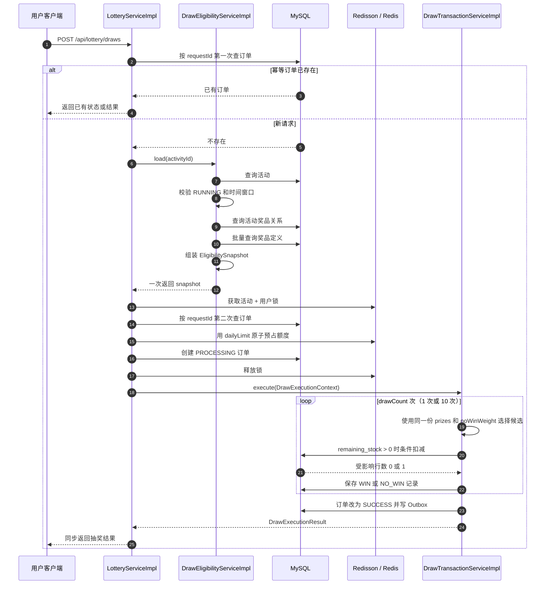

# LuckyHub 抽奖资格快照 `EligibilitySnapshot` 详解

## 1. 这篇文档解决什么问题

在 `LotteryServiceImpl.draw()` 中有这样一行代码：

```java
DrawEligibilityService.EligibilitySnapshot snapshot =
        eligibilityService.load(command.activityId());
```

第一次看到它时，很容易产生这些疑问：

- 为什么需要调用 `eligibilityService.load()`？
- 为什么返回值要保存到名叫 `snapshot` 的变量里？
- `EligibilitySnapshot` 到底保存了什么？
- 它是不是把数据库复制了一份？
- 它和 MySQL 的事务快照是不是同一个东西？
- 十连抽为什么只加载一次快照？
- 快照中的库存如果过期了，会不会超卖？

这篇文档不从孤立的 Java 语法开始背概念，而是从用户发起一次抽奖请求开始，沿着程序真正的执行顺序，一步一步回答这些问题。

读完后，你应该能够：

1. 拆解目标代码左边和右边每一部分的含义；
2. 说清 `EligibilitySnapshot` 是怎样查询、校验和组装出来的；
3. 找到五个字段分别来自哪里、后来被谁使用；
4. 理解快照为何能保证一次抽奖使用同一组配置；
5. 理解快照为什么不能代替数据库原子库存扣减；
6. 在其他业务中自己设计类似的只读输入快照。

> 本文讲的是 LuckyHub 当前代码中的实际实现。所有类名、字段和调用顺序都对应仓库源码。

---

## 2. 先看一次抽奖的完整位置

用户调用的接口是：

```http
POST /api/lottery/draws
```

请求体可以是：

```json
{
  "requestId": "2eeb7ef0-9e89-4ff1-903f-a15a55fb18ee",
  "activityId": 1001,
  "drawCount": 10
}
```

它表示：用户要参加活动 `1001`，进行十连抽，这次请求的幂等标识是一个 UUID。

请求先进入 `LotteryController.draw()`：

```java
@PostMapping("/draws")
@Operation(summary = "单抽或十连抽")
@RequirePermission(PermissionCodes.LOTTERY_DRAW)
public ApiResponse<DrawOrderView> draw(@Valid @RequestBody DrawCommand command) {
    return ApiResponse.success(lotteryService.draw(command));
}
```

Controller 主要负责接收 HTTP 请求、校验 DTO 和检查权限。真正的抽奖编排发生在：

```text
LotteryServiceImpl.draw(DrawCommand command)
```

把这次请求中与快照有关的主流程先画出来：

```text
LotteryServiceImpl.draw
  -> 校验 command
  -> 从 LoginContext 取得 userId
  -> 第一次查询 MySQL 幂等订单
  -> eligibilityService.load(activityId)
  -> 得到 EligibilitySnapshot
  -> 获取“活动 + 用户”维度的锁
  -> 第二次查询 MySQL 幂等订单
  -> Redis 额度预占（使用 snapshot.dailyLimit）
  -> 创建 PROCESSING 抽奖订单
  -> 释放锁
  -> 创建 DrawExecutionContext
     （使用 snapshot.noWinWeight、prizes、snapshotTime）
  -> DrawTransactionServiceImpl.execute
  -> 单抽一次或循环十次
  -> 返回抽奖结果
```

由此可以先得到一个重要结论：

> `EligibilitySnapshot` 不是最终抽奖结果，而是执行这张新抽奖订单时需要的一组只读输入数据。

它处在“已经确认不是历史幂等请求”和“真正开始额度预占、权重抽取”之间。

---

## 3. 程序执行到目标代码之前，已经做了什么

`LotteryServiceImpl.draw()` 的开头是：

```java
public DrawOrderView draw(DrawCommand command) {
    validate(command);
    long userId = LoginContext.require().userId();
    LotteryDrawOrder existing = orderMapper.selectByRequestId(command.requestId());
    if (existing != null) return resolveExisting(existing, command, userId, false);

    DrawEligibilityService.EligibilitySnapshot snapshot =
            eligibilityService.load(command.activityId());
    // 后续流程……
}
```

### 3.1 第一步：校验请求参数

```java
validate(command);
```

这里会检查：

- `command` 不能为 `null`；
- `activityId` 必须为正数；
- `drawCount` 只能是 `1` 或 `10`；
- `requestId` 必须是不超过 64 个字符的标准 UUID。

参数格式都不正确，就没有必要查询活动，更没有必要创建快照。

### 3.2 第二步：取得当前登录用户

```java
long userId = LoginContext.require().userId();
```

抽奖额度、锁和订单都与用户有关，所以程序先从登录上下文得到用户 ID。

### 3.3 第三步：第一次幂等检查

```java
LotteryDrawOrder existing = orderMapper.selectByRequestId(command.requestId());
if (existing != null) return resolveExisting(existing, command, userId, false);
```

如果这个 `requestId` 已经对应一张订单，程序直接读取已有结果或返回已有状态，不会重新加载活动配置。

为什么？因为幂等重试要回答的是：

> “上一次相同请求的结果是什么？”

而不是：

> “按照现在的新配置再抽一次是什么结果？”

所以只有数据库中不存在这个请求的订单，程序才执行目标代码，为一张新订单加载配置。

---

## 4. 逐部分拆解这一行 Java 代码

目标代码是：

```java
DrawEligibilityService.EligibilitySnapshot snapshot =
        eligibilityService.load(command.activityId());
```

可以按照赋值表达式的通用结构理解：

```text
变量类型                                      变量名       = 返回一个对象的方法调用
DrawEligibilityService.EligibilitySnapshot   snapshot    = eligibilityService.load(...)
```

### 4.1 `DrawEligibilityService.EligibilitySnapshot` 是变量类型

它表示变量里允许保存什么类型的数据。

这里不是普通的：

```java
EligibilitySnapshot snapshot
```

而是：

```java
DrawEligibilityService.EligibilitySnapshot snapshot
```

原因是 `EligibilitySnapshot` 声明在 `DrawEligibilityService` 接口内部：

```java
public interface DrawEligibilityService {
    EligibilitySnapshot load(long activityId);

    record EligibilitySnapshot(...) {
    }
}
```

这种类型叫嵌套类型。完整名字要表达它属于谁：

```text
外部类型 DrawEligibilityService
    └── 嵌套类型 EligibilitySnapshot
```

在没有单独 `import` 嵌套类型时，使用完整写法最清楚：

```java
DrawEligibilityService.EligibilitySnapshot
```

### 4.2 `snapshot` 是局部变量名

```java
snapshot
```

它是 `draw()` 方法执行期间存在的局部变量。它保存的是 `EligibilitySnapshot` 对象的引用。

这里的“保存”是指：

```text
让局部变量 snapshot 指向 load() 返回的对象
```

不是指：

- 向数据库插入一行；
- 写入 Redis；
- 写入磁盘文件；
- 永久保存整个对象。

当这次 `draw()` 调用结束，并且没有其他对象继续引用它时，这个局部引用就不再被使用，之后可以由 JVM 垃圾回收。

为什么变量叫 `snapshot`？因为它表示某个时间点加载出来的一组配置视图。这个名字在表达业务含义，而不是 Java 的特殊关键字。

变量也可以叫 `data`，代码仍然能编译：

```java
DrawEligibilityService.EligibilitySnapshot data =
        eligibilityService.load(command.activityId());
```

但 `data` 太模糊。`snapshot` 能提醒后来读代码的人：

> 后续使用的是这次请求加载时看到的配置，不是每一步都重新读取最新数据库数据。

### 4.3 `=` 是赋值

Java 会先执行等号右侧：

```java
eligibilityService.load(command.activityId())
```

只有右侧成功返回，才会把返回的对象引用赋给左侧的 `snapshot`。

如果 `load()` 抛出业务异常，例如活动不存在或活动不可参与，那么赋值不会完成，程序也不会进入后面的锁、额度预占和抽奖事务。

### 4.4 `command.activityId()` 取得请求中的活动 ID

`command` 是 `DrawCommand`，它也是一个 `record`。调用：

```java
command.activityId()
```

取得请求体中的活动 ID，例如 `1001L`。

这个值会作为参数传给：

```java
load(long activityId)
```

### 4.5 `eligibilityService.load(...)` 执行查询与校验

`eligibilityService` 的声明类型是：

```java
private final DrawEligibilityService eligibilityService;
```

Spring 注入的实际实现类是：

```java
DrawEligibilityServiceImpl
```

因此运行时调用的是：

```java
DrawEligibilityServiceImpl.load(long activityId)
```

这个方法负责两件事：

1. 判断这个活动现在是否允许抽奖；
2. 把后续抽奖需要的配置集中组装成一份快照。

### 4.6 整行代码翻译成人话

可以把它完整翻译为：

> 根据请求中的活动 ID，查询并校验当前活动及其奖品配置；如果一切有效，就构造一份本次新抽奖订单使用的资格配置快照，并让局部变量 `snapshot` 保存这个对象的引用。

---

## 5. 为什么不直接在后面随用随查数据库

假设没有 `EligibilitySnapshot`，代码可能变成这样：

```java
int dailyLimit = activityMapper.selectById(activityId).getDailyLimit();
quotaService.reserve(..., dailyLimit);

int noWinWeight = activityMapper.selectById(activityId).getNoWinWeight();

for (int i = 0; i < drawCount; i++) {
    List<MarketingActivityPrize> prizes = relationMapper.selectByActivityId(activityId);
    drawEngine.select(prizes, noWinWeight);
}
```

这会带来几个问题。

### 5.1 查询分散，业务规则难以看全

活动状态在一处检查，时间在另一处检查，每日限额在 Redis 预占前查询，奖品权重在循环里查询。以后很难确定：真正开始抽奖以前，到底完成了哪些资格校验？

`load()` 把这些入口规则放在一个明确边界中：

```text
先完整加载和校验
    ↓
成功后才允许进入后续抽奖编排
```

### 5.2 十连抽可能看到不同配置

假设十连抽执行到第 4 次时，管理员修改了某个奖品的权重。如果每次循环都重新查询：

```text
第 1～4 抽：旧权重
第 5～10 抽：新权重
```

同一张十连抽订单就混入了两套规则，结果不容易解释和复现。

当前实现是在进入十次循环以前加载一次：

```text
一次新订单
    └── 一份 EligibilitySnapshot
            └── 十次抽取共同使用
```

### 5.3 重复查询增加数据库压力

单抽查一次和十连抽查十次，在访问量增大时差别很明显。集中加载可以减少重复查询，也能把奖品定义按 ID 批量读取。

### 5.4 参数容易在层与层之间丢失

后续流程不仅需要奖品，还需要每日限额、未中奖权重和统一时间。如果每个参数各自查询，很容易出现某个地方用了新值、另一个地方还用了旧值。

快照把一次操作需要共同使用的输入组织成一个有名字的对象：

```java
EligibilitySnapshot
```

它相当于告诉后续代码：

> 这是本次新抽奖订单已经校验过的一整包配置，请共同使用，不要各自再去拼装。

---

## 6. 进入 `DrawEligibilityServiceImpl.load()`

接口只规定能力：

```java
public interface DrawEligibilityService {
    EligibilitySnapshot load(long activityId);
}
```

实现类完成真正的数据库查询和对象组装。下面严格按照执行顺序阅读。

### 6.1 查询活动

```java
MarketingActivity activity = activityMapper.selectById(activityId);
```

这里根据主键查询 `marketing_activity` 表，得到活动实体 `MarketingActivity`。

假设传入的是 `1001L`，可以把它理解为执行了类似的查询：

```sql
SELECT *
FROM marketing_activity
WHERE id = 1001;
```

MyBatis-Plus 根据实体和 Mapper 生成实际 SQL。

### 6.2 活动不存在就立即停止

```java
if (activity == null) {
    throw new BusinessException(LotteryErrorCode.ACTIVITY_NOT_FOUND);
}
```

如果数据库没有这个活动，无法继续查询它的规则和奖品。方法抛出 `ACTIVITY_NOT_FOUND`，因此目标代码右边没有正常返回值，左边的 `snapshot` 也不会完成赋值。

### 6.3 取得统一的当前时间

真实代码是：

```java
LocalDateTime now = LocalDateTime.now(clock)
        .truncatedTo(ChronoUnit.MILLIS);
```

这里没有到处调用 `LocalDateTime.now()`，而是使用注入的 `Clock`。生产环境中的 Clock 根据 `LotteryProperties.zoneId()` 创建：

```java
Clock.system(properties.zoneId())
```

这样做有两个主要作用：

- 统一使用配置的业务时区，例如 `Asia/Shanghai`；
- 测试时可以注入固定 Clock，让“现在几点”变成可预测的数据。

`truncatedTo(ChronoUnit.MILLIS)` 表示截断到毫秒。项目中的注释说明，MySQL `DATETIME(3)` 保存毫秒精度，所以同步返回和以后从 MySQL 读取时要保持相同精度。

### 6.4 校验活动状态和时间窗口

```java
if (activity.getStatus() != ActivityStatus.RUNNING
        || activity.getStartTime() == null
        || activity.getEndTime() == null
        || now.isBefore(activity.getStartTime())
        || !now.isBefore(activity.getEndTime())) {
    throw new BusinessException(LotteryErrorCode.ACTIVITY_NOT_AVAILABLE);
}
```

它要求以下条件全部成立：

```text
status == RUNNING
startTime != null
endTime != null
now >= startTime
now < endTime
```

结束时间采用左闭右开的区间：

```text
[startTime, endTime)
```

也就是说，刚好等于 `endTime` 时已经不能抽奖。

任何条件不满足，都会抛出 `ACTIVITY_NOT_AVAILABLE`。这就是类名中 `Eligibility` 的含义：不仅加载数据，还要确认当前具有参与资格。

### 6.5 查询活动与奖品之间的关系

```java
List<MarketingActivityPrize> relations = relationMapper.selectList(
        new LambdaQueryWrapper<MarketingActivityPrize>()
                .eq(MarketingActivityPrize::getActivityId, activityId)
                .orderByAsc(MarketingActivityPrize::getSortOrder)
                .orderByAsc(MarketingActivityPrize::getId));
```

`MarketingActivityPrize` 不是奖品定义本身，而是“某活动配置了某奖品”的关联数据。这里保存：

- 活动奖品关系 ID；
- 活动 ID；
- 奖品 ID；
- 本活动中的权重；
- 本活动中的总库存和剩余库存；
- 排序值。

查询按 `sortOrder`、`id` 升序排列。顺序很重要，因为权重算法会按照列表顺序依次划分区间。

### 6.6 收集奖品 ID

```java
List<Long> prizeIds = relations.stream()
        .map(MarketingActivityPrize::getPrizeId)
        .distinct()
        .toList();
```

这段流操作的执行过程是：

```text
relations
  -> 只取每条关系的 prizeId
  -> 去重 distinct()
  -> 收集为 List<Long>
```

为什么还要查奖品表？因为奖品名称、奖品类型、图片 URL 和启用状态属于 `MarketingPrize`，不在活动奖品关联记录中。

### 6.7 批量查询奖品定义

```java
Map<Long, MarketingPrize> prizes = prizeIds.isEmpty()
        ? Map.of()
        : prizeMapper.selectByIds(prizeIds).stream()
                .collect(Collectors.toMap(
                        MarketingPrize::getId,
                        Function.identity()));
```

如果没有奖品 ID，直接得到空 Map。如果有，就一次批量查询，再转换成：

```text
key   = prizeId
value = MarketingPrize 实体
```

例如：

```text
3  -> MarketingPrize{id=3, prizeName="10元优惠券", ...}
8  -> MarketingPrize{id=8, prizeName="保温杯", ...}
```

这样在组装每条活动奖品关系时，可以根据 `prizeId` 快速找到奖品定义。

### 6.8 组装每个奖品的 `DrawPrizeSnapshot`

真实映射代码是：

```java
List<DrawPrizeSnapshot> snapshots = relations.stream().map(relation -> {
    MarketingPrize prize = prizes.get(relation.getPrizeId());
    if (prize == null) {
        throw new BusinessException(LotteryErrorCode.DRAW_WEIGHT_INVALID);
    }
    return new DrawPrizeSnapshot(
            relation.getId(),
            prize.getId(),
            prize.getPrizeName(),
            prize.getPrizeType(),
            prize.getImageUrl(),
            relation.getWeight(),
            relation.getRemainingStock(),
            Integer.valueOf(1).equals(prize.getStatus()));
}).toList();
```

这里把两个数据库实体中的字段合并了：

```text
MarketingActivityPrize（活动中的配置）
  ├── relation.id            -> activityPrizeId
  ├── relation.weight        -> weight
  └── relation.remainingStock -> remainingStock

MarketingPrize（奖品定义）
  ├── prize.id               -> prizeId
  ├── prize.prizeName        -> prizeName
  ├── prize.prizeType        -> prizeType
  ├── prize.imageUrl         -> prizeImageUrl
  └── prize.status == 1      -> enabled

合并后
  └── DrawPrizeSnapshot
```

如果关系指向的奖品不存在，说明配置已经不完整，程序抛出 `DRAW_WEIGHT_INVALID`，不会拿残缺配置继续抽奖。

`DrawPrizeSnapshot` 自己也会校验：

- 两个 ID 必须为正数；
- 奖品名称不能为空；
- 奖品类型不能为空；
- 权重必须大于 0；
- 剩余库存不能小于 0。

### 6.9 读取活动级规则并处理空值

```java
int dailyLimit = activity.getDailyLimit() == null
        ? 0 : activity.getDailyLimit();
int noWinWeight = activity.getNoWinWeight() == null
        ? 0 : activity.getNoWinWeight();
```

这里把数据库实体中的可空包装类型转换成快照中的基本类型 `int`。如果数据库值是 `null`，当前实现按 `0` 处理。

两个字段的含义分别是：

- `dailyLimit`：每个用户在这个活动中每天最多可抽多少次；
- `noWinWeight`：独立的未中奖权重。

### 6.10 校验配置是否能够用于抽奖

```java
if (dailyLimit < 0
        || noWinWeight < 0
        || (snapshots.isEmpty() && noWinWeight == 0)) {
    throw new BusinessException(LotteryErrorCode.DRAW_WEIGHT_INVALID);
}
```

它拒绝：

- 每日限额为负数；
- 未中奖权重为负数；
- 奖品列表为空，并且未中奖权重也是 0。

最后一种情况意味着总权重为 0，没有任何可以抽取的区间。

### 6.11 构造并返回总快照

```java
return new EligibilitySnapshot(
        activityId,
        dailyLimit,
        noWinWeight,
        snapshots,
        now);
```

到这里，前面分散在活动表、活动奖品关系表、奖品表和业务时钟中的数据，被组装成一个对象返回给 `LotteryServiceImpl.draw()`。

于是最初那行赋值才真正完成：

```text
load() 成功返回 EligibilitySnapshot 对象
                 ↓
局部变量 snapshot 指向这个对象
```

---

## 7. `EligibilitySnapshot` 的定义为什么这样写

完整定义位于 `DrawEligibilityService` 中：

```java
record EligibilitySnapshot(
        long activityId,
        int dailyLimit,
        int noWinWeight,
        List<DrawPrizeSnapshot> prizes,
        LocalDateTime snapshotTime) {

    public EligibilitySnapshot {
        prizes = List.copyOf(prizes);
    }
}
```

### 7.1 为什么使用 `record`

`EligibilitySnapshot` 的主要任务是携带数据，不负责修改活动、扣减库存或操作 Redis。这类数据载体很适合使用 Java `record`。

声明 record 后，Java 会根据组件自动提供：

- 构造器；
- `activityId()`、`dailyLimit()` 等访问器；
- `equals()`；
- `hashCode()`；
- `toString()`。

因此读取字段的写法是：

```java
snapshot.dailyLimit()
snapshot.noWinWeight()
snapshot.prizes()
snapshot.snapshotTime()
```

而不是实体类常见的：

```java
snapshot.getDailyLimit()
```

### 7.2 record 适合表达“一旦创建就不再重新赋值”

record 的组件都是最终字段，没有 `setDailyLimit()`、`setPrizes()` 这样的 setter。

这能减少下面这种危险情况：

```java
snapshot.setNoWinWeight(999); // record 中不存在
```

后续服务只能读取已经加载的数据，不能随手把某个字段改掉。

### 7.3 紧凑构造器是什么

这段代码：

```java
public EligibilitySnapshot {
    prizes = List.copyOf(prizes);
}
```

叫 record 的紧凑构造器。它省略了完整参数列表，因为参数就是 record 声明中的五个组件。

构造过程可以理解为：

```text
调用 new EligibilitySnapshot(..., prizes, ...)
       ↓
先执行紧凑构造器
       ↓
把参数 prizes 替换成 List.copyOf(prizes) 的结果
       ↓
再赋给对象内部的 prizes 字段
```

### 7.4 为什么使用 `List.copyOf(prizes)`

假设调用者传进来的是一个可修改的 `ArrayList`：

```java
List<DrawPrizeSnapshot> list = new ArrayList<>();
EligibilitySnapshot snapshot = new EligibilitySnapshot(
        1001L, 20, 30, list, now);

list.clear();
```

如果快照直接保存同一个可变列表引用，外部的 `list.clear()` 可能把快照里的奖品也清空。

`List.copyOf(prizes)` 会得到一个不可修改列表。以后执行：

```java
snapshot.prizes().clear();
```

会抛出：

```text
UnsupportedOperationException
```

这样可以保护“这张订单使用的奖品列表结构”不被后续代码增删。

### 7.5 `List.copyOf` 能保护什么，不能保护什么

它能保护的是 JVM 内这份列表的结构：

```text
不能 add
不能 remove
不能 clear
```

它不能做到：

- 锁住 MySQL 中的奖品行；
- 阻止管理员修改数据库配置；
- 阻止其他用户扣减库存；
- 自动刷新为数据库最新值；
- 让整个对象永久存在。

另外，`List.copyOf` 是浅层复制。这里列表元素 `DrawPrizeSnapshot` 本身也是 record，没有 setter，所以当前模型整体上很适合只读使用。但不能把“record + List.copyOf”泛化成对任意对象都进行了深复制。

---

## 8. 五个字段分别代表什么

### 8.1 `activityId`

```java
long activityId
```

表示本次抽奖所属活动。它来自请求命令中的 `command.activityId()`，并经过活动存在性校验。

### 8.2 `dailyLimit`

```java
int dailyLimit
```

表示活动配置的用户每日抽奖次数上限。它来自 `MarketingActivity.dailyLimit`，后续传给 Redis 额度预占逻辑。

### 8.3 `noWinWeight`

```java
int noWinWeight
```

表示独立未中奖区间的权重。它来自 `MarketingActivity.noWinWeight`，后续交给权重抽奖引擎。

### 8.4 `prizes`

```java
List<DrawPrizeSnapshot> prizes
```

表示这个活动中的奖品配置视图。每个元素同时包含活动级配置和奖品基本信息，包括权重、加载时剩余库存、启用状态、名称、类型和图片 URL。

### 8.5 `snapshotTime`

```java
LocalDateTime snapshotTime
```

表示加载并校验这份配置时的统一业务时间。它来自配置时区对应的 `Clock`，并截断到毫秒精度。

这个时间不只是为了记录“什么时候查的”。后续抽奖完成、失败补偿和事件数据也会复用它，避免一次请求的多个步骤各自取得略有差异的时间。

---

## 9. 到这里先做一次总结

目标代码：

```java
DrawEligibilityService.EligibilitySnapshot snapshot =
        eligibilityService.load(command.activityId());
```

不是简单地“查询一个活动”。它完成了一个业务边界：

```text
输入：activityId
  ↓
查询活动
  ↓
确认活动现在可以参加
  ↓
查询活动奖品关系与奖品定义
  ↓
合并为只读奖品配置
  ↓
校验限额和权重配置
  ↓
输出：本次新抽奖订单共同使用的 EligibilitySnapshot
```

下一部分继续跟踪这个对象：它被赋给 `snapshot` 以后，五个字段究竟怎样进入额度预占、十连抽、权重算法、数据库库存扣减和抽奖结果。

---

## 10. 快照返回后，五个字段流向哪里

先看字段来源与后续使用位置的总表：

| 字段 | 主要来源 | 后续用途 |
|---|---|---|
| `activityId` | 抽奖命令 | 标识本次配置所属活动；活动 ID 本身也用于锁、订单和事件身份 |
| `dailyLimit` | 活动表 | Redis 每日抽奖额度预占 |
| `noWinWeight` | 活动表 | 权重抽取中的独立未中奖区间 |
| `prizes` | 活动奖品关系表 + 奖品表 | 权重选择、库存条件扣减、中奖结果字段保存 |
| `snapshotTime` | 配置时区的当前时间 | 抽奖完成时间、失败补偿时间和事件发生时间 |

注意：`snapshot.activityId()` 当前没有在后半段重新取出使用。代码继续使用已经校验过的 `command.activityId()`。快照仍保存它，是为了让这份对象本身具有完整身份，避免它成为一包不知道属于哪个活动的数据。

### 10.1 `dailyLimit` 进入 Redis 额度预占

取得锁并完成第二次幂等检查后，程序执行：

```java
QuotaReservationResult reserved = quotaService.reserve(
        new QuotaReservationRequest(
                command.requestId(),
                command.activityId(),
                userId,
                command.drawCount(),
                snapshot.dailyLimit()));
```

这里用到了：

```java
snapshot.dailyLimit()
```

假设每日上限是 20，用户今天已经抽了 12 次，现在请求十连抽：

```text
已经使用 12 次 + 本次请求 10 次 = 22 次
22 > 每日上限 20
```

Redis Lua 额度预占会拒绝请求。此时不会创建成功抽奖结果。

为什么 `dailyLimit` 要从快照传进去，而不是 Redis 自己去查 MySQL？

因为 Redis 额度服务只负责原子地判断和预占次数，它不应该再负责查询活动表、判断活动状态和拼装业务配置。职责被分成：

```text
DrawEligibilityService
  -> 从 MySQL 加载并校验业务规则

DrawQuotaService
  -> 根据已经给出的规则，在 Redis 原子预占额度
```

### 10.2 其余字段进入 `DrawExecutionContext`

创建 `PROCESSING` 订单并离开锁以后，代码执行：

```java
DrawExecutionResult result = transactionService.execute(
        new DrawExecutionContext(
                order.getId(),
                command.requestId(),
                userId,
                command.activityId(),
                command.drawCount(),
                locked.reservation().drawDate(),
                snapshot.noWinWeight(),
                snapshot.prizes(),
                snapshot.snapshotTime()));
```

三个字段继续向后传递：

```text
snapshot.noWinWeight()  -> 抽奖算法的未中奖权重
snapshot.prizes()      -> 奖品权重、库存提示和展示信息
snapshot.snapshotTime() -> 本次抽奖使用的统一时间
```

`DrawExecutionContext` 可以理解为“执行抽奖事务所需的完整输入”。它把订单身份、用户身份、抽奖次数和资格快照中的配置合并起来。

它的构造器也执行：

```java
prizes = List.copyOf(prizes);
```

因此奖品列表跨过服务边界以后仍然保持不可增删。

---

## 11. 用时序图看完整数据流



从图里重点观察两件事：

1. `load(activityId)` 对一张新订单只调用一次；
2. 单抽或十连抽循环发生在 `DrawTransactionServiceImpl.execute()` 内，循环使用的是已经传入的同一份上下文。

---

## 12. 快照怎样进入权重抽奖算法

事务服务先把展示信息更丰富的 `DrawPrizeSnapshot` 转成算法真正需要的 `PrizeWeightSnapshot`：

```java
List<PrizeWeightSnapshot> weights = context.prizes().stream()
        .map(DrawPrizeSnapshot::toWeightSnapshot)
        .toList();
```

转换方法是：

```java
public PrizeWeightSnapshot toWeightSnapshot() {
    return new PrizeWeightSnapshot(
            activityPrizeId,
            prizeId,
            weight,
            remainingStock,
            enabled);
}
```

为什么要再转一次？

因为抽奖算法只关心：

- 这是哪条活动奖品配置；
- 对应哪个奖品；
- 权重是多少；
- 加载时库存是否大于 0；
- 奖品是否启用。

它不需要奖品名称、图片 URL 和奖品类型。把算法输入单独建模，可以避免权重算法依赖与数学选择无关的展示字段。

十连抽循环是：

```java
for (int sequence = 1; sequence <= context.drawCount(); sequence++) {
    DrawCandidate candidate = drawEngine.select(
            weights,
            context.noWinWeight());
    DrawPrizeSnapshot wonPrize = resolveFinalWin(
            candidate,
            context.prizes());
    results.add(persistResult(context, sequence, wonPrize));
}
```

注意 `weights` 在循环外创建。这意味着十次抽取使用同一个列表，并没有每次重新调用 `eligibilityService.load()`。

### 12.1 算法怎样划分权重区间

`WeightedDrawEngineImpl.select()` 先计算：

```java
long totalWeight = noWinWeight;
for (PrizeWeightSnapshot prize : prizes) {
    totalWeight = Math.addExact(totalWeight, prize.weight());
}
```

然后生成：

```java
long selected = randomSource.nextLong(totalWeight);
```

随机值范围是：

```text
[0, totalWeight)
```

算法按奖品列表顺序累加区间。如果随机值落在某个奖品的区间：

```java
if (!prize.enabled() || prize.remainingStock() == 0) {
    return DrawCandidate.noWin();
}
return DrawCandidate.prize(
        prize.activityPrizeId(),
        prize.prizeId());
```

也就是说：

- 启用并且快照库存大于 0：返回奖品候选；
- 已禁用或者快照库存为 0：这个区间直接返回未中奖；
- 随机值落在所有奖品区间之后：落入独立未中奖区间。

当前实现不会把禁用、售罄奖品的权重重新平均分给其他奖品。它们原有的区间会变成未中奖。

---

## 13. 完整十连抽例子

假设活动 `1001` 的配置是：

```text
dailyLimit = 20
noWinWeight = 30
```

活动配置了三个奖品：

| 顺序 | 奖品 | 权重 | 快照剩余库存 | 是否启用 |
|---:|---|---:|---:|---|
| 1 | 10 元优惠券 | 10 | 2 | 是 |
| 2 | 保温杯 | 40 | 10 | 否 |
| 3 | 手机 | 20 | 0 | 是 |

总权重是：

```text
10 + 40 + 20 + 30 = 100
```

算法按照当前列表顺序形成区间：

| 随机值区间 | 对应配置 | 最终候选行为 |
|---|---|---|
| `[0, 10)` | 10 元优惠券 | 可以成为奖品候选 |
| `[10, 50)` | 保温杯 | 已禁用，直接变成未中奖 |
| `[50, 70)` | 手机 | 快照库存为 0，直接变成未中奖 |
| `[70, 100)` | 独立未中奖权重 | 未中奖 |

这里虽然三个奖品的总权重是 70，但真正有机会进入数据库扣减的只有优惠券的 10 个权重点。

### 13.1 加载时只构造一次

`eligibilityService.load(1001L)` 返回的对象可以抽象表示为：

```java
new EligibilitySnapshot(
        1001L,
        20,
        30,
        List.of(
                new DrawPrizeSnapshot(..., "10 元优惠券", ..., 10, 2, true),
                new DrawPrizeSnapshot(..., "保温杯", ..., 40, 10, false),
                new DrawPrizeSnapshot(..., "手机", ..., 20, 0, true)
        ),
        LocalDateTime.of(2026, 8, 1, 14, 30, 0));
```

然后这一个对象中的数据被装入一个 `DrawExecutionContext`，供十次循环使用。

### 13.2 假设十次随机值如下

为了便于理解，假设随机值依次是：

```text
5, 18, 76, 3, 55, 8, 91, 42, 6, 81
```

先只看权重算法：

| 第几抽 | 随机值 | 落入区间 | 算法候选 |
|---:|---:|---|---|
| 1 | 5 | 优惠券 | 优惠券候选 |
| 2 | 18 | 禁用保温杯 | 未中奖 |
| 3 | 76 | 独立未中奖 | 未中奖 |
| 4 | 3 | 优惠券 | 优惠券候选 |
| 5 | 55 | 售罄手机 | 未中奖 |
| 6 | 8 | 优惠券 | 优惠券候选 |
| 7 | 91 | 独立未中奖 | 未中奖 |
| 8 | 42 | 禁用保温杯 | 未中奖 |
| 9 | 6 | 优惠券 | 优惠券候选 |
| 10 | 81 | 独立未中奖 | 未中奖 |

这里出现了四次优惠券候选，但加载快照时优惠券只有 2 件库存。

### 13.3 快照库存不会在循环中自动减成 1、0

这是理解当前实现最重要的细节之一。

快照中始终保存的是加载时看到的：

```text
remainingStock = 2
```

第一抽成功扣减数据库以后，Java 内存中的 `DrawPrizeSnapshot` 不会变成库存 1。第二次成功以后，它也不会变成库存 0。

原因是快照本来就是只读数据，而且真正库存可能同时被很多应用实例和用户修改。只改本机对象既不能代表全局库存，也不能防止超卖。

所以四次优惠券候选都会继续尝试数据库条件扣减。假设没有其他并发用户：

| 候选出现次序 | 数据库扣减前库存 | 条件更新结果 | 最终结果 |
|---:|---:|---:|---|
| 第 1 次候选 | 2 | 影响 1 行，库存变 1 | WIN |
| 第 2 次候选 | 1 | 影响 1 行，库存变 0 | WIN |
| 第 3 次候选 | 0 | 影响 0 行 | NO_WIN |
| 第 4 次候选 | 0 | 影响 0 行 | NO_WIN |

因此这次十连抽最终只有两个优惠券中奖结果。

---

## 14. 为什么有快照还必须执行 MySQL 原子扣减

候选奖品进入 `resolveFinalWin()`：

```java
private DrawPrizeSnapshot resolveFinalWin(
        DrawCandidate candidate,
        List<DrawPrizeSnapshot> snapshots) {
    if (candidate.type() == DrawCandidate.Type.NO_WIN) {
        return null;
    }

    DrawPrizeSnapshot snapshot = snapshots.stream()
            .filter(prize ->
                    prize.activityPrizeId() == candidate.activityPrizeId()
                    && prize.prizeId() == candidate.prizeId())
            .findFirst()
            .orElseThrow(...);

    return inventoryService.decrementIfAvailable(snapshot.activityPrizeId())
            ? snapshot
            : null;
}
```

候选只是“随机数选中了这个奖品区间”，不是最终中奖。最终还要调用：

```java
inventoryService.decrementIfAvailable(activityPrizeId)
```

Mapper 执行的是：

```sql
UPDATE marketing_activity_prize
SET remaining_stock = remaining_stock - 1
WHERE id = #{activityPrizeId}
  AND remaining_stock > 0
```

判断规则是：

```text
影响 1 行 -> 扣减成功 -> 最终 WIN
影响 0 行 -> 已经没库存 -> 最终 NO_WIN
```

### 14.1 两个用户并发争抢最后一件奖品

假设用户 A 和用户 B 都在快照里看到库存为 1：

```text
用户 A 的 snapshot：remainingStock = 1
用户 B 的 snapshot：remainingStock = 1
```

两人的随机数又都选中了这个奖品。此时如果只相信快照，两人都会中奖，发生超卖。

数据库实际执行顺序可能是：

```text
用户 A：UPDATE ... WHERE remaining_stock > 0
        影响 1 行，库存从 1 变成 0

用户 B：UPDATE ... WHERE remaining_stock > 0
        条件不成立，影响 0 行
```

最终：

```text
用户 A -> WIN
用户 B -> NO_WIN
```

所以两者职责不同：

| 机制 | 负责什么 |
|---|---|
| `EligibilitySnapshot` | 为当前订单提供一组稳定、只读的配置输入 |
| MySQL 条件更新 | 在所有并发请求之间决定最后一件库存到底属于谁 |

一句话记忆：

> 快照负责“这次按什么规则抽”，原子 SQL 负责“这个奖品最终还有没有”。

---

## 15. 管理员在抽奖过程中修改配置会怎样

假设发生下面的时间线：

```text
T1  用户请求调用 load()，得到旧配置 snapshot
T2  管理员修改未中奖权重、奖品名称或奖品启用状态
T3  当前用户继续使用 T1 已经加载的内存快照完成本张订单
T4  下一个新抽奖请求再次调用 load()，读取 T2 修改后的配置
```

当前请求不会自动刷新 `snapshot`。这是“一张新订单使用一套加载时配置”的直接结果。

### 15.1 这样做的好处

- 一次十连抽不会前五次使用旧权重、后五次使用新权重；
- 后续步骤不需要反复查询同一配置；
- 日志和调试时更容易知道当前订单用了什么输入；
- 各层共享同一个时间和同一组奖品展示信息。

### 15.2 必须承认的边界

当前快照不是带配置版本号的持久化配置，也没有锁住管理员修改。

因此，如果业务以后要求：

> 管理员一旦禁用奖品，所有已经加载但尚未扣库存的请求也必须立即停止使用它。

仅靠当前快照做不到，需要另行设计配置版本校验、数据库状态条件或更强的发布切换机制。那属于未来需求，不能把它误认为当前代码已经实现。

库存是例外：即使当前快照里库存大于 0，最终仍然重新通过数据库条件扣减，所以库存不会只相信旧快照。

---

## 16. 三种容易混淆的“快照”

### 16.1 本文的内存配置快照

```text
名称：EligibilitySnapshot / DrawPrizeSnapshot
位置：当前 Java 进程的内存
创建：DrawEligibilityServiceImpl.load()
生命周期：主要服务于当前 draw() 调用和这张新订单
作用：集中携带加载时已经校验的抽奖输入
是否整体落库：否
```

### 16.2 MySQL 事务一致性读快照

数据库理论中也有“快照”。例如 InnoDB 在某些事务隔离级别下，会为一致性读提供某个可见版本。

它的作用是决定：

```text
当前数据库事务执行 SELECT 时，可以看到哪些已提交的数据版本
```

它由数据库事务机制管理，不是我们定义一个 Java record 就自动得到的。

当前 `EligibilitySnapshot` 的含义是应用层业务命名，不能把它等同于 InnoDB 的 Read View 或事务隔离快照。

### 16.3 抽奖结果中的历史奖品字段快照

中奖后，`persistResult()` 会把加载时的奖品展示字段写入抽奖记录：

```java
record.setPrizeId(prize.prizeId());
record.setPrizeName(prize.prizeName());
record.setPrizeType(prize.prizeType());
record.setPrizeImageUrl(prize.prizeImageUrl());
```

这可以看作结果历史快照：以后管理员把奖品名称从“10 元优惠券”改成“夏日优惠券”，已经发生的抽奖记录仍能展示当时保存的名称。

它与 `EligibilitySnapshot` 的区别是：

| 对比 | 内存资格配置快照 | 抽奖结果字段快照 |
|---|---|---|
| 何时产生 | 抽奖执行前 | 某一抽最终确定结果时 |
| 保存位置 | JVM 内存 | `lottery_draw_record` 表 |
| 保存内容 | 限额、权重、奖品配置、时间 | 实际中奖奖品的名称、类型、图片等 |
| 生命周期 | 当前调用为主 | 长期历史记录 |
| 主要目的 | 稳定本次执行输入 | 保留当时结果展示信息 |

---

## 17. 第二部分总结

现在可以把完整关系概括为：

```text
EligibilitySnapshot
  ├── dailyLimit
  │     └── Redis 额度预占
  ├── noWinWeight
  │     └── WeightedDrawEngine
  ├── prizes
  │     ├── PrizeWeightSnapshot -> 随机候选
  │     ├── activityPrizeId -> MySQL 原子扣库存
  │     └── name/type/image -> 中奖记录字段
  └── snapshotTime
        ├── 订单完成时间
        ├── 失败补偿发生时间
        └── Outbox 事件发生时间
```

快照让一张订单使用统一输入，但它不宣称自己拥有最新库存。算法选出候选后，MySQL 条件更新才完成最终裁决。

---

## 18. 怎样通过断点亲眼观察快照

只读文档容易有一种错觉：每个概念都能理解，但回到 IDE 仍然不知道程序到底怎样走。下面按真实执行顺序调试一次。

### 18.1 准备一个可抽奖活动

确保测试数据满足：

- 活动状态为 `RUNNING`；
- 当前时间位于 `[startTime, endTime)`；
- 活动配置了至少一个合法奖品，或者 `noWinWeight > 0`；
- 登录用户具有 `lottery:draw` 权限；
- 请求使用一个从未用过的 UUID `requestId`。

如果重复使用已经成功的 `requestId`，第一次幂等检查就会直接返回历史结果，看不到 `load()`。

### 18.2 断点一：进入 `LotteryServiceImpl.draw()`

文件：

```text
src/main/java/com/dongqh/luckyhub/lottery/service/impl/LotteryServiceImpl.java
```

在下面一行打断点：

```java
validate(command);
```

观察：

```text
command.requestId()
command.activityId()
command.drawCount()
```

继续单步执行到：

```java
long userId = LoginContext.require().userId();
```

观察 `userId` 是否是当前 JWT 对应的用户。

### 18.3 断点二：进入 `DrawEligibilityServiceImpl.load()`

文件：

```text
src/main/java/com/dongqh/luckyhub/lottery/service/impl/DrawEligibilityServiceImpl.java
```

在方法第一行打断点：

```java
MarketingActivity activity = activityMapper.selectById(activityId);
```

单步执行并依次观察：

| 变量 | 应该观察什么 |
|---|---|
| `activityId` | 是否与请求中的 ID 相同 |
| `activity` | 状态、开始时间、结束时间、每日上限、未中奖权重 |
| `now` | 是否使用预期业务时区，是否位于活动时间窗口 |
| `relations` | 活动配置了几条奖品关系，顺序、权重和库存是什么 |
| `prizeIds` | 是否从关系中正确提取并去重 |
| `prizes` | Map 中是否包含名称、类型、图片和状态 |
| `snapshots` | 两张表的字段是否已经正确合并 |
| `dailyLimit` | 空值是否按 0 处理 |
| `noWinWeight` | 空值是否按 0 处理 |

执行到返回行时：

```java
return new EligibilitySnapshot(
        activityId, dailyLimit, noWinWeight, snapshots, now);
```

使用 IDE 的 Evaluate Expression 可以临时查看：

```java
new DrawEligibilityService.EligibilitySnapshot(
        activityId, dailyLimit, noWinWeight, snapshots, now)
```

不要在生产数据环境里执行带副作用的表达式；这里构造的是只读内存对象，没有数据库写操作。

### 18.4 断点三：回到目标代码下一行

回到 `LotteryServiceImpl.draw()`，在目标代码后面打断点：

```java
LotteryDrawOrder[] createdOrder = new LotteryDrawOrder[1];
```

此时目标赋值已经完成，可以展开：

```text
snapshot
  ├── activityId
  ├── dailyLimit
  ├── noWinWeight
  ├── prizes
  │     ├── activityPrizeId
  │     ├── prizeId
  │     ├── prizeName
  │     ├── prizeType
  │     ├── prizeImageUrl
  │     ├── weight
  │     ├── remainingStock
  │     └── enabled
  └── snapshotTime
```

这一步最适合建立直觉：`snapshot` 就是一个普通 Java 对象引用，里面装着已经组装好的值。

### 18.5 断点四：观察字段被拆开使用

继续执行到额度预占：

```java
quotaService.reserve(new QuotaReservationRequest(
        ...,
        snapshot.dailyLimit()));
```

观察：

- `snapshot.dailyLimit()`；
- `command.drawCount()`；
- 返回的 `reserved.status()`；
- `reserved.drawDate()`。

然后执行到 `new DrawExecutionContext(...)`，确认：

```text
context.noWinWeight == snapshot.noWinWeight
context.prizes       == 相同内容的不可修改奖品列表
context.drawTime     == snapshot.snapshotTime
```

### 18.6 断点五：观察十连抽循环

文件：

```text
src/main/java/com/dongqh/luckyhub/lottery/service/impl/DrawTransactionServiceImpl.java
```

在循环中打断点：

```java
DrawCandidate candidate = drawEngine.select(
        weights, context.noWinWeight());
```

每次停下时观察：

| 变量 | 含义 |
|---|---|
| `sequence` | 当前是第几抽，从 1 到 10 |
| `weights` | 循环外只创建一次的算法输入 |
| `context.noWinWeight()` | 这张订单共同使用的未中奖权重 |
| `candidate` | 随机算法选出的候选，不一定是最终中奖 |
| `wonPrize` | 数据库扣减成功后的最终奖品；为 `null` 表示未中奖 |
| `results` | 已完成的各抽结果 |

特别观察：即使前面已经成功扣减奖品库存，`weights` 中的 `remainingStock` 仍是加载快照时的数字。

### 18.7 断点六：观察原子库存结果

文件：

```text
src/main/java/com/dongqh/luckyhub/inventory/service/ActivityPrizeInventoryServiceImpl.java
```

代码是：

```java
public boolean decrementIfAvailable(long activityPrizeId) {
    return inventoryMapper.decrementIfAvailable(activityPrizeId) == 1;
}
```

进入方法后观察 `activityPrizeId`。单步执行 Mapper 调用后，观察比较表达式结果：

```text
true  -> SQL 影响 1 行 -> 最终中奖
false -> SQL 影响 0 行 -> 最终未中奖
```

如果想清楚看到从有库存到无库存的变化，可以给某个测试奖品设置很小的库存，并连续使用不同 `requestId` 抽奖。

---

## 19. 现有单元测试怎样证明这套设计

### 19.1 `DrawEligibilityServiceTests`

重点测试名是：

```java
loadsOneImmutableShanghaiTimeConfigurationSnapshot()
```

测试注入了一个固定 Clock：

```java
private static final Clock CLOCK = Clock.fixed(
        Instant.parse("2026-07-31T04:00:00Z"),
        ZoneId.of("Asia/Shanghai"));
```

UTC 的 `04:00` 在上海时区是 `12:00`。因此测试可以稳定断言：

```java
assertThat(snapshot.snapshotTime().toString())
        .isEqualTo("2026-07-31T12:00");
```

它还断言：

```java
assertThat(snapshot.dailyLimit()).isEqualTo(10);
assertThat(snapshot.noWinWeight()).isEqualTo(60);
```

这证明活动级字段被正确放入总快照。

奖品定义在测试中被设置为禁用：

```java
prize.setStatus(0);
```

测试最终检查：

```java
assertThat(item.enabled()).isFalse();
```

这证明奖品状态被转换成了快照中的布尔值。

最后执行：

```java
snapshot.prizes().clear()
```

并要求抛出 `UnsupportedOperationException`，证明 `List.copyOf` 确实阻止了列表结构修改。

这个测试还验证：

```java
verify(activityMapper, times(1)).selectById(1L);
```

也就是一次 `load()` 中只查询一次活动主记录。

### 19.2 不可参与活动测试

测试：

```java
rejectsNonRunningOrOutsideTimeWindow()
```

分别验证禁用状态和到达结束时间时抛出：

```text
ACTIVITY_NOT_AVAILABLE
```

而且：

```java
verifyNoInteractions(relationMapper, prizeMapper);
```

这说明活动资格都不成立时，不会继续查询奖品配置。程序尽早失败，减少无意义查询。

### 19.3 `LotteryServiceTests`

重点测试名是：

```java
orchestratesInRequiredOrderAndReturnsExactSynchronousResult()
```

测试用 Mockito 的 `InOrder` 检查调用顺序：

```text
第一次 MySQL 幂等检查
-> eligibility.load(20L)
-> 获取锁
-> 第二次 MySQL 幂等检查
-> quota.reserve(... dailyLimit == 5)
-> createProcessing(...)
-> transaction.execute(...)
```

它还检查事务上下文收到了：

```java
c.prizes().size() == 1
        && c.noWinWeight() == 25
        && c.drawTime().equals(now)
```

这证明快照字段没有停留在 `load()` 的返回对象里，而是确实被传到了后续抽奖事务。

最后：

```java
verify(eligibility, times(1)).load(20L);
```

证明一次新抽奖请求只加载一次资格快照。

### 19.4 幂等测试说明了什么

测试：

```java
returnsStoredSuccessBeforeEligibilityEvenAcrossPolicyOrDateChanges()
```

当第一次 MySQL 查询已经找到成功订单时，测试要求：

```java
verifyNoInteractions(eligibility, lock, quota, lifecycle, transaction);
```

这正好说明：历史幂等请求不重新加载当前配置。否则管理员改了规则以后，同一个 `requestId` 可能被当成一次新抽奖处理，破坏幂等性。

---

## 20. 常见疑问与误解

### 20.1 为什么不直接写 `var snapshot`？

Java 可以写：

```java
var snapshot = eligibilityService.load(command.activityId());
```

编译器能够推断出类型是 `EligibilitySnapshot`，功能上没有区别。

当前代码显式写出：

```java
DrawEligibilityService.EligibilitySnapshot
```

能让读者不跳转方法也看出返回值类型，并且明确这个嵌套类型属于资格服务。`var` 和快照设计本身无关，只是局部变量类型的书写选择。

### 20.2 为什么不把多个字段分别保存为变量？

当然可以写成：

```java
int dailyLimit = ...;
int noWinWeight = ...;
List<DrawPrizeSnapshot> prizes = ...;
LocalDateTime now = ...;
```

但这些值共同属于“一次资格加载”的结果。使用一个类型可以：

- 表达它们属于同一业务概念；
- 保证方法一次返回完整数据；
- 方便测试整体构造结果；
- 以后增加配置字段时集中修改边界；
- 减少参数在不同层之间散落。

### 20.3 为什么不在每一抽前重新查询库存？

当前实现不是完全不查库存，而是不每次重新加载整份配置。

```text
整份活动与奖品配置 -> 一张订单加载一次
最终库存条件判断   -> 每个奖品候选都执行一次原子 UPDATE
```

这保留了一致的权重输入，同时把并发库存真相交给数据库。

### 20.4 record 是不是绝对不可变？

不是。

record 保证自己的组件引用不能被重新赋值，但如果组件指向一个可变对象，对象内部仍可能改变。例如：

```java
record BadSnapshot(List<String> items) {
}
```

如果直接保存可变 `ArrayList`，外部仍然可能 `clear()`。

LuckyHub 又使用了：

```java
prizes = List.copyOf(prizes);
```

并且列表元素 `DrawPrizeSnapshot` 也是 record，所以当前结构适合作为只读数据。但“record 自动深度不可变”仍然是错误说法。

### 20.5 快照会不会过期？

它没有定时器，也没有 `expired` 字段。所谓“过期”是业务意义上的：数据库可能在它创建后发生变化，而快照仍保存加载时的数据。

当前实现选择让本张新订单继续使用这组加载时配置。下一张新订单会重新调用 `load()`。

### 20.6 快照能不能防止超卖？

不能。快照只记录加载时看到的库存。防止库存减成负数依靠：

```sql
WHERE remaining_stock > 0
```

以及检查受影响行数是否为 1。

### 20.7 为什么快照在锁外加载？

当前执行顺序是先加载资格快照，再获取“活动 + 用户”锁。这样活动和奖品查询不会占用锁的持有时间，锁内主要完成第二次幂等检查、Redis 额度预占和创建处理中订单。

代价是加载快照与进入锁之间可能发生配置变更。当前设计接受“一张订单使用加载时配置”，库存仍由后续原子 SQL 最终校验。

### 20.8 为什么第二次幂等检查还需要保留？

两个相同 `requestId` 的请求可能同时通过第一次查询，然后各自加载快照。获取同一把锁后，第一个请求创建订单；第二个请求进入锁时再次查询，就能发现订单已经存在，不再重复预占和执行抽奖。

所以：

```text
快照解决配置输入问题
双重幂等检查解决重复请求竞争问题
Redis/Redisson 锁串行化同一活动用户的关键区间
数据库原子 UPDATE 解决全局库存竞争问题
```

它们不是互相替代的关系。

### 20.9 为什么禁用奖品的权重不重新分给其他奖品？

这是当前权重算法的明确策略。总权重计算仍包含所有奖品权重；随机值落到禁用或快照库存为 0 的奖品区间时，直接返回 `NO_WIN`。

因此禁用一个奖品会提高实际未中奖概率，而不是提高其他奖品的中奖概率。

---

## 21. 怎样在其他业务中设计类似快照

不要因为看到类名里有 `Snapshot`，就机械地把所有查询结果都包装成快照。可以按下面五步判断和设计。

### 第一步：确定一个明确的操作周期

先回答：哪些步骤属于同一次业务操作？

LuckyHub 中是：

```text
一张新抽奖订单从资格加载到抽奖事务完成
```

如果操作周期都不明确，就无法决定快照应该保持多久。

### 第二步：列出操作期间需要共同使用的输入

LuckyHub 列出的是：

```text
activityId
dailyLimit
noWinWeight
prizes
snapshotTime
```

这些值要么被多个后续步骤使用，要么需要在一次操作中保持一致。

### 第三步：把集中查询和入口校验放在一个服务中

可以抽象成：

```java
public interface OperationEligibilityService {
    OperationSnapshot load(long targetId);
}
```

实现方法负责：

```text
查询主对象
-> 检查状态和时间
-> 查询关联配置
-> 校验数据完整性
-> 返回快照
```

这样后续编排只接收“已经通过入口资格校验的输入”。

### 第四步：使用不可变数据载体

如果数据主要用于读取，可以使用 record：

```java
public record OperationSnapshot(
        long targetId,
        int limit,
        List<ItemSnapshot> items,
        LocalDateTime snapshotTime) {

    public OperationSnapshot {
        items = List.copyOf(items);
    }
}
```

同时检查组件中是否包含其他可变对象，不要误以为 record 自动完成深复制。

### 第五步：把并发最终真相留给原子写操作

快照适合保存规则和输入，但库存、余额、名额等会被并发修改的数据，最终确认必须使用可靠的并发控制，例如：

- 带条件的 SQL UPDATE；
- 唯一约束；
- 数据库行锁；
- Redis Lua 原子脚本；
- 根据业务设计的版本号或乐观锁。

选择哪种机制取决于数据最终保存在哪里和一致性要求，不能只依赖 Java 内存对象。

---

## 22. 非抽奖示例：提交订单时的价格快照

假设电商用户提交订单。商品价格、促销折扣和运费规则可能在结算过程中被运营人员修改。

可以先设计：

```java
public interface CheckoutEligibilityService {
    CheckoutSnapshot load(long userId, List<Long> skuIds);

    record CheckoutSnapshot(
            long userId,
            List<SkuPriceSnapshot> skuPrices,
            int discountAmount,
            int shippingAmount,
            LocalDateTime snapshotTime) {

        public CheckoutSnapshot {
            skuPrices = List.copyOf(skuPrices);
        }
    }
}
```

业务流程可以是：

```text
接收提交订单请求
-> 查询并校验商品是否可售
-> 加载当前价格、促销和运费
-> 构造 CheckoutSnapshot
-> 使用同一快照计算订单金额
-> 原子扣减数据库库存
-> 将订单成交价格长期写入订单明细
```

这里同样要区分：

```text
价格快照 -> 决定本张订单按什么价格计算
原子库存 -> 决定商品最后是否还有货
订单明细 -> 长期保存实际成交价
```

这与 LuckyHub 的关系是：

| 抽奖业务 | 订单业务 |
|---|---|
| `EligibilitySnapshot` | `CheckoutSnapshot` |
| 奖品权重和未中奖权重 | 商品价格和促销规则 |
| MySQL 条件扣减奖品库存 | MySQL 条件扣减商品库存 |
| 抽奖记录保存奖品名称等 | 订单明细保存成交价 |

掌握的重点不是类名，而是分清“操作输入”“并发最终真相”和“长期历史结果”。

---

## 23. 自测题

可以先遮住答案，自己回答。

### 题目 1

目标代码中的 `snapshot` 是不是数据库表？

答案：不是。它是 `draw()` 方法中的局部变量，持有 `EligibilitySnapshot` 内存对象的引用。

### 题目 2

`DrawEligibilityService.EligibilitySnapshot` 为什么中间有一个点？

答案：因为 `EligibilitySnapshot` 是声明在 `DrawEligibilityService` 接口内部的嵌套 record，点号表示类型归属。

### 题目 3

`load()` 抛出 `ACTIVITY_NOT_AVAILABLE` 后，`snapshot` 里保存什么？

答案：赋值不会完成，程序直接沿异常流程退出，不会进入后续额度预占和抽奖事务。

### 题目 4

十连抽会调用十次 `eligibilityService.load()` 吗？

答案：不会。一张新订单在进入锁以前加载一次，十次循环复用同一个 `DrawExecutionContext` 中的权重和奖品列表。

### 题目 5

`List.copyOf(prizes)` 能不能锁住数据库奖品库存？

答案：不能。它只防止 JVM 中这份列表被增删。

### 题目 6

快照库存为 1，是否代表用户一定能获得奖品？

答案：不代表。其他并发请求可能先扣完库存，最终必须以数据库条件更新是否影响 1 行为准。

### 题目 7

候选奖品扣减库存失败以后，当前实现会重抽一次吗？

答案：不会。`resolveFinalWin()` 返回 `null`，这一抽最终保存为 `NO_WIN`。

### 题目 8

管理员在当前请求加载快照后修改权重，当前十连抽会自动切换新权重吗？

答案：不会。当前订单继续使用加载时的内存配置；后续新请求重新调用 `load()` 后才读取新配置。

### 题目 9

幂等请求已经存在成功订单时，为什么不重新加载快照？

答案：它应该返回同一次请求的历史结果，而不是按照当前配置再执行一次新抽奖。

### 题目 10

应用层 `EligibilitySnapshot` 与 MySQL 事务快照是同一个机制吗？

答案：不是。前者是我们定义的 Java 只读业务对象，后者是数据库事务隔离和数据版本可见性机制。

---

## 24. 最终记忆模型

如果整篇文档只记住一幅图，可以记住下面这段：

```text
请求中的 activityId
        ↓
DrawEligibilityServiceImpl.load
        ├── 查询并校验活动
        ├── 查询活动奖品关系
        ├── 批量查询奖品定义
        └── 组装只读 EligibilitySnapshot
                    ↓
          snapshot 局部变量持有对象引用
                    ↓
        ┌───────────┼────────────────┐
        ↓           ↓                ↓
   dailyLimit   noWinWeight        prizes
        ↓           ↓                ↓
  Redis 额度     权重算法       候选 + 原子扣库存
                                    ↓
                         成功 WIN / 失败 NO_WIN
```

最终可以用三句话概括：

1. `EligibilitySnapshot` 是一次新抽奖订单加载时形成的只读业务输入，不是数据库或 Redis 中的一张“快照表”。
2. 它让单抽或十连抽共享同一组资格、权重、奖品信息和时间，避免执行过程中反复查询、混用配置。
3. 它不负责解决并发超卖；真正库存必须由 `remaining_stock > 0` 的 MySQL 原子条件更新作最终判断。
