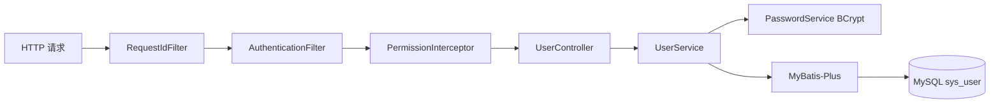
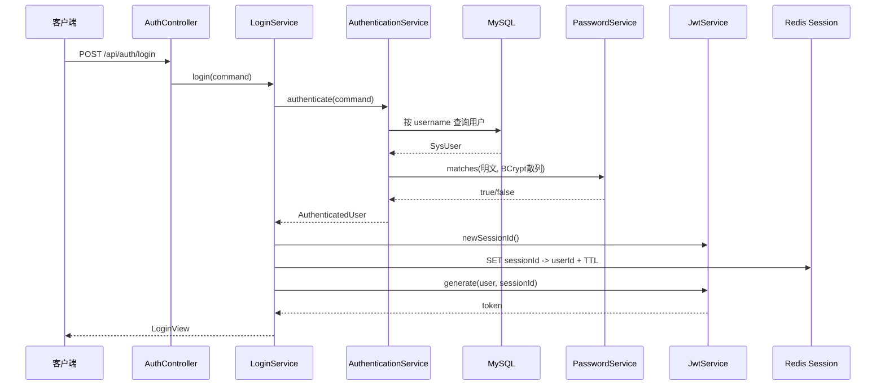
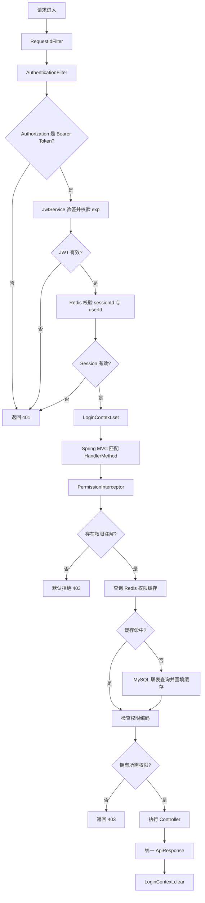
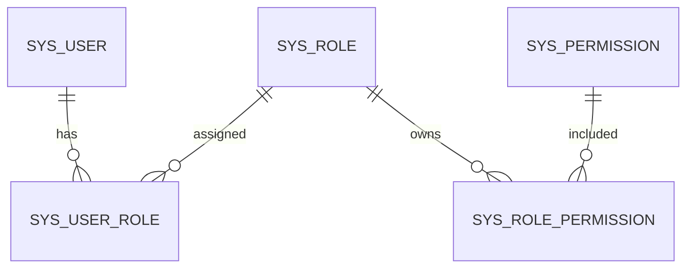

# LuckyHub 认证、授权与 RBAC 实战教学

> 文档基于 LuckyHub 当前源码编写，更新时间：2026-07-19。
>
> 目标不是罗列类名，而是解释一个用户请求如何经过数据库、JWT、Redis、Filter、ThreadLocal、Interceptor 和 RBAC，最终决定能否执行 Controller。最后一章给出把这套能力迁移到其他 Spring Boot 项目的方法。

## 1. 当前完成到了哪里

LuckyHub 当前已经完成了一个可运行的认证与权限基础设施：

1. 使用 Docker Compose 运行 MySQL 8.4 和 Redis 7.4。
2. 使用 Flyway V1 创建用户、角色、权限、营销活动、抽奖订单和权益等 11 张表。
3. 使用 Flyway V2 初始化 `ADMIN`、11 项后台权限以及 ADMIN 与权限的关联。
4. 创建用户时使用 BCrypt 保存密码散列，不保存明文密码。
5. 登录时校验用户名、密码和用户状态。
6. 登录成功后签发 JWT，同时在 Redis 创建服务端 Session。
7. 使用认证 Filter 保护 `/api/auth/me`、`/api/auth/logout` 和全部 `/api/admin/*` 请求。
8. 使用 `ThreadLocal` 保存一次请求中的登录人信息。
9. 完成角色、权限、用户角色、角色权限和用户最终权限查询。
10. 使用 `@RequirePermission` 和 MVC Interceptor 校验后台接口权限，并对漏写注解的后台接口默认拒绝。
11. 扩展 `/api/auth/me`，返回用户基本信息、角色编码和权限编码。
12. 使用 Redis 缓存用户权限，并在用户角色或角色权限变化时清除缓存。
13. 使用统一成功响应、统一异常响应、参数校验、Request ID 和 OpenAPI。

当前明确没有实现用户、角色状态管理接口。营销活动、抽奖、库存和权益发放目前只有数据库表，还没有进入业务实现阶段。

---

## 2. 先从一次用户操作看懂全流程

理解认证授权最好的方式，不是先背 Filter、Interceptor 的定义，而是跟着一个用户走完整流程。

### 2.1 用户创建

管理员调用：

```http
POST /api/admin/users
Authorization: Bearer <admin-token>
Content-Type: application/json

{
  "username": "player01",
  "password": "StrongPassword123!",
  "nickname": "玩家01"
}
```

请求依次经历：



关键点：

- `RequestIdFilter` 给请求生成追踪 ID。
- `AuthenticationFilter` 证明调用者是谁。
- `PermissionInterceptor` 检查调用者是否有 `user:create`。
- `UserServiceImpl` 检查用户名唯一性。
- `PasswordService` 把密码变成 BCrypt 散列。
- `SysUserMapper` 将用户写入 MySQL。

认证回答“你是谁”，授权回答“你能做什么”。两者不能混成一个概念。

### 2.2 用户登录

用户调用：

```http
POST /api/auth/login
Content-Type: application/json

{
  "username": "admin",
  "password": "用户输入的密码"
}
```

登录流程：



登录成功时实际产生两份状态：

- 客户端持有 JWT。
- 服务端 Redis 持有 Session。

这是一种“JWT + 服务端会话”的混合方案。它既保留 JWT 自包含、易于传输的特点，又允许服务端通过删除 Redis Session 立即让 Token 失效。

### 2.3 用户携带 JWT 访问后台接口

```http
GET /api/admin/roles
Authorization: Bearer eyJ...
```

完整链路：



这个流程解释了为什么项目同时需要 Filter 和 Interceptor：

- Filter 在 Spring MVC 找到 Controller 之前运行，适合做通用认证。
- Interceptor 在 HandlerMapping 已经找到 Controller 方法后运行，适合读取方法上的权限注解。

---

## 3. 基础设施：Docker、MySQL、Redis 和 Flyway

### 3.1 Docker Compose 做了什么

`compose.yaml` 定义 MySQL 和 Redis：

- MySQL 容器名为 `luckyhub-mysql`，宿主机端口为 3307。
- Redis 容器名为 `luckyhub-redis`，宿主机端口为 6379。
- 两个服务都配置了健康检查和持久化 Volume。
- 密码从 `.env` 注入，不写进源码。

常用命令：

```powershell
docker compose up -d
docker compose ps
docker compose logs mysql
docker compose logs redis
```

迁移到其他项目时，应复制的是“通过环境变量配置容器”的思想，而不是复制 LuckyHub 的真实密码。

### 3.2 Flyway 的价值

Flyway 把数据库结构变更当作不可变历史：

```text
V1__create_luckyhub_schema.sql
V2__initialize_admin_role_and_base_permissions.sql
```

应用启动时 Flyway 会：

1. 查看 `flyway_schema_history`。
2. 校验已经执行过的迁移文件校验和。
3. 按版本执行尚未执行的迁移。
4. 记录执行结果。

因此 V1、V2 一旦进入环境就不能修改。后续数据库变化必须创建 V3、V4，而不是回头编辑旧文件。

V1 没有使用物理外键，但保留了唯一索引、普通索引、复合主键和 CHECK 约束。无物理外键不代表没有关系，而是由应用和 SQL 维护关系完整性。

### 3.3 V2 为什么不固定 ID

不同环境里的自增 ID 可能不同，所以 V2 使用业务编码查询真实 ID：

```sql
SELECT admin_role.id, base_permission.id
FROM sys_role AS admin_role
JOIN sys_permission AS base_permission
WHERE admin_role.role_code = 'ADMIN';
```

这里依赖的是稳定的 `role_code`、`permission_code`，而不是某个环境恰好生成的 `role_id = 11`。

这是一条可迁移原则：跨环境初始化数据时，用唯一业务键定位记录，不要假设自增主键一致。

---

## 4. 用户创建与 BCrypt 密码安全

### 4.1 为什么不能保存明文密码

如果数据库泄漏，明文密码会直接暴露。密码也不适合使用可逆加密，因为拿到密钥就能还原全部密码。

LuckyHub 使用 BCrypt：

```java
String encoded = passwordEncoder.encode(rawPassword);
boolean matched = passwordEncoder.matches(rawPassword, encoded);
```

BCrypt 每次编码会使用随机盐，因此同一个密码多次编码得到的字符串通常不同。登录时不能再次 encode 后比较字符串，而必须使用 `matches`。

### 4.2 LuckyHub 的 PasswordService

`PasswordService` 封装了三个能力：

- `hash`：创建用户时生成密码散列。
- `matches`：登录时校验密码。
- `needsUpgrade`：将来提高 BCrypt 工作因子时判断旧散列是否需要升级。

项目还限制密码不能超过 72 个 UTF-8 字节。这是 BCrypt 的算法边界，不等同于 72 个 Java 字符。中文字符通常占多个 UTF-8 字节。

### 4.3 创建用户的数据流

```text
CreateUserCommand
→ Bean Validation
→ 检查 username 是否存在
→ BCrypt hash
→ SysUserMapper.insert
→ UserView
```

应用层先检查用户名可以给用户友好提示，但数据库唯一索引仍是最终并发防线。两个并发请求都通过应用层检查时，只能有一个通过唯一索引插入成功。

迁移到其他项目时，建议保留“应用预检查 + 数据库唯一约束 + 捕获 DuplicateKeyException”三层设计。

---

## 5. JWT：客户端携带的登录凭证

### 5.1 LuckyHub 的 JWT 内容

`JwtService.generate` 写入：

| JWT 字段 | LuckyHub 内容 | 用途 |
|---|---|---|
| `sub` | 用户 ID | 标识用户 |
| `jti` | 随机 Session ID | 关联 Redis Session |
| `username` | 用户名 | 构造请求上下文 |
| `iat` | 签发时间 | 记录 Token 生成时间 |
| `exp` | 过期时间 | 限制 Token 生命周期 |
| signature | HMAC 签名 | 防止内容被篡改 |

JWT 经过 Base64URL 编码，但不是加密。任何拿到 Token 的人都可以解码 Payload，所以不要把密码、身份证号等敏感信息放进 JWT。

### 5.2 签名解决什么问题

客户端可以看到 Payload，但无法在不知道密钥的情况下修改 `sub` 或 `username` 后生成有效签名。

服务端解析时执行：

```java
Jwts.parser()
        .verifyWith(secretKey)
        .build()
        .parseSignedClaims(token);
```

解析同时验证签名和过期时间。解析失败统一转换为 `INVALID_TOKEN`。

### 5.3 为什么 JWT 还需要 Redis

纯 JWT 最大的问题是签发后很难主动撤销。用户退出登录后，即使客户端删除 Token，被复制出去的 Token 在 `exp` 前仍然有效。

LuckyHub 在 JWT 的 `jti` 中放 Session ID，并在 Redis 保存：

```text
luckyhub:auth:session:{sessionId} -> userId
```

TTL 与 JWT 有效期相同。每次请求除了验证 JWT，还检查 Redis Session。退出时删除 Redis Key，旧 JWT 虽然签名仍正确，但 Session 已不存在，因此立即失效。

这套模式适用于需要主动登出、封禁会话或后台控制会话的系统。

---

## 6. Redis 的第一种应用：服务端 Session

### 6.1 创建 Session

登录成功后：

```java
redisTemplate.opsForValue().set(
        key,
        userId.toString(),
        Duration.ofSeconds(expireSeconds)
);
```

TTL 很重要。没有 TTL 的 Session 会永久留在 Redis，形成垃圾数据和安全风险。

### 6.2 校验 Session

```java
String storedUserId = redisTemplate.opsForValue().get(key);
return userId.toString().equals(storedUserId);
```

这里同时校验 Session 是否存在，以及 Session 是否属于 JWT 中的用户。

### 6.3 登出

```java
redisTemplate.delete(buildKey(sessionId));
```

登出不需要维护 JWT 黑名单，只要删除对应 Session 即可。

### 6.4 当前边界

当前 Session 模型只保存 `sessionId -> userId`，因此支持单次会话登出，但还不能按用户一次删除全部 Session。如果将来要实现“修改密码后全部设备退出”或“禁用用户后立即下线”，需要额外维护：

```text
userId -> sessionId 集合
```

或者为用户维护 Session Version。

---

## 7. Filter：在进入 Controller 前完成身份认证

### 7.1 RequestIdFilter

`RequestIdFilter` 的顺序最高，它负责：

1. 接受安全格式的客户端 `X-Request-Id`，否则生成 UUID。
2. 写入 Request Attribute。
3. 写入响应头。
4. 写入日志 MDC。
5. 请求结束后清除 MDC。

这样一条请求在日志、成功响应和失败响应中都能使用同一个 Request ID 排查问题。

### 7.2 AuthenticationFilter

认证 Filter 继承 `OncePerRequestFilter`，保证一次 Servlet Dispatch 中只执行一次核心逻辑。

步骤如下：

```text
提取 Authorization 请求头
→ 校验 Bearer 前缀
→ JwtService.parse
→ SessionService.isValid
→ 创建 LoginPrincipal
→ LoginContext.set
→ filterChain.doFilter
→ finally LoginContext.clear
```

注册范围：

```text
/api/auth/me
/api/auth/logout
/api/admin/*
```

`/api/auth/login` 不在其中，因为登录接口必须允许未登录用户调用。

### 7.3 Filter 为什么自己写错误响应

Filter 位于 Spring MVC 的 DispatcherServlet 之外。认证失败发生得太早，不能完全依赖 Controller 层的 `@RestControllerAdvice`。

因此 `AuthenticationFilter` 使用 Spring Boot 4 的：

```java
tools.jackson.databind.ObjectMapper
```

直接把 `ErrorResponse` 写入响应流。

### 7.4 Filter 迁移到其他项目的方法

迁移时至少需要：

1. 一个 Token 解析服务。
2. 一个服务端 Session 校验服务。
3. 一个请求级当前用户上下文。
4. 明确哪些 URL 需要认证。
5. 统一的 401 JSON 响应。
6. `finally` 中清理 ThreadLocal。

---

## 8. LoginContext 与 ThreadLocal

Filter 已经得到了用户 ID、用户名和 Session ID，后面的 Controller 不应该重复解析 JWT。

LuckyHub 将其放入：

```java
ThreadLocal<LoginPrincipal>
```

同一个请求通常由同一个 Servlet 工作线程同步处理，因此后续代码可以调用：

```java
LoginPrincipal principal = LoginContext.require();
```

`require()` 比 `get()` 更适合需要登录的业务，因为上下文缺失时会直接抛 401，而不是在业务深处出现 NullPointerException。

最重要的是清理：

```java
finally {
    LoginContext.clear();
}
```

Servlet 容器会复用线程。如果忘记 remove，下一个请求可能读到上一个用户的信息，这是严重的越权风险。

如果其他项目大量使用异步、WebFlux、虚拟线程或线程池切换，不能直接假设普通 ThreadLocal 会自动传播，应改用对应的上下文传播机制。

---

## 9. RBAC：用户为什么最终拥有某项权限

### 9.1 五张核心表



具体含义：

- `sys_user`：用户。
- `sys_role`：角色，例如 ADMIN。
- `sys_permission`：原子权限，例如 `user:create`。
- `sys_user_role`：用户与角色的多对多关系。
- `sys_role_permission`：角色与权限的多对多关系。

用户不直接绑定权限，而是通过角色得到权限：

```text
用户 → 用户角色 → 角色 → 角色权限 → 权限
```

### 9.2 最终权限 SQL

`SysPermissionMapper.selectEffectivePermissionsByUserId` 使用联表查询：

```sql
SELECT DISTINCT p.*
FROM sys_user u
JOIN sys_user_role ur ON ur.user_id = u.id
JOIN sys_role r
  ON r.id = ur.role_id
 AND r.status = 1
JOIN sys_role_permission rp ON rp.role_id = r.id
JOIN sys_permission p ON p.id = rp.permission_id
WHERE u.id = #{userId}
  AND u.status = 1
ORDER BY p.permission_code;
```

`DISTINCT` 用于处理一个用户通过多个角色获得同一权限的情况。

### 9.3 MyBatis-Plus 在项目中的使用

实体类通过 `@TableName` 对应表，通过 `@TableId(type = IdType.AUTO)` 对应自增主键。

配置：

```yaml
mybatis-plus:
  configuration:
    map-underscore-to-camel-case: true
```

因此数据库的 `role_code` 可以自动映射到 Java 的 `roleCode`。

Lambda Wrapper 示例：

```java
Wrappers.<SysUserRole>lambdaQuery()
        .eq(SysUserRole::getUserId, userId)
```

它等价于：

```sql
WHERE user_id = ?
```

Lambda 写法比手写字符串 `"user_id"` 更容易在重构时发现错误，但仍要注意字段语义。例如用用户 ID 查询关联表时，条件必须是 `getUserId`，不能误写成 `getRoleId`。

---

## 10. Interceptor 与权限注解

### 10.1 权限注解

LuckyHub 定义：

```java
@Target({ElementType.TYPE, ElementType.METHOD})
@Retention(RetentionPolicy.RUNTIME)
public @interface RequirePermission {
    String value();
}
```

Controller 使用：

```java
@PostMapping
@RequirePermission(PermissionCodes.USER_CREATE)
public ApiResponse<UserView> createUser(...) {
    // ...
}
```

权限编码集中在 `PermissionCodes`，这样注解参数是编译期常量，可以减少字符串拼写错误。

### 10.2 PermissionInterceptor 做了什么

Interceptor 注册到：

```text
/api/admin/**
```

Spring MVC 找到 HandlerMethod 后，Interceptor：

1. 优先读取方法注解。
2. 方法没有时读取 Controller 类注解。
3. 后台 HandlerMethod 没有注解时默认拒绝。
4. 从 LoginContext 获取当前用户。
5. 查询用户权限编码集合。
6. 判断集合是否包含注解要求的权限。
7. 不包含时抛出 `ForbiddenException`，返回 403。

### 10.3 为什么是默认拒绝

如果采用“没有注解就放行”，开发者新增后台接口时只要忘记写一行注解，就会产生未授权入口。

当前策略是 fail closed：

```text
后台 Controller + 无权限注解 = 拒绝
```

非 HandlerMethod 请求仍然放给 Spring 继续处理，以便不存在的资源正常返回 404。

### 10.4 Filter 和 Interceptor 的职责边界

| 比较项 | Filter | HandlerInterceptor |
|---|---|---|
| 所在层 | Servlet | Spring MVC |
| 执行时机 | DispatcherServlet 前后 | HandlerMethod 前后 |
| 是否容易知道 Controller 方法 | 否 | 是 |
| LuckyHub 用途 | JWT + Session 认证 | 权限注解授权 |
| 典型失败 | 401 | 403 |

迁移到其他项目时，不要简单地认为“安全就全部写在拦截器里”。认证越早越好，而注解授权需要知道具体 HandlerMethod，两者处在不同层。

---

## 11. Redis 的第二种应用：权限缓存

### 11.1 为什么需要缓存

后台每次鉴权都执行五表联查，会增加 MySQL 压力。权限一般读多写少，适合缓存。

LuckyHub 使用：

```text
rbac:permissions:user:{userId}
```

Value 是排序后的 JSON 数组：

```json
["permission:read","role:read","user:create"]
```

TTL 为 10 分钟。

JSON 的好处是可以把“用户确实没有权限”保存成 `[]`。如果只用 Key 不存在表示空权限，就无法区分缓存未命中和已缓存的空结果。

### 11.2 Cache Aside 模式

```text
先查 Redis
→ 命中：返回缓存
→ 未命中：查询 MySQL
→ 写入 Redis
→ 返回结果
```

当前 `findPermissionCodes` 在查缓存前仍会按主键确认用户存在，因此缓存减少的是昂贵的权限联表查询，并没有做到完全零数据库查询。这是当前实现的安全与性能权衡。

### 11.3 Redis 故障时为什么回源数据库

`PermissionCacheService` 捕获 Redis 数据访问异常：

- 读失败：视为缓存未命中，回源 MySQL。
- 写失败：记录日志，仍返回数据库结果。
- 缓存 JSON 损坏：删除坏 Key，再查数据库。

缓存应该是加速层，不应该成为权限系统唯一的数据源。MySQL 才是事实来源。

### 11.4 空权限缓存

用户没有权限时写入：

```json
[]
```

读取后返回 `Optional.of(emptySet())`。而缓存不存在或 Redis 故障返回 `Optional.empty()`。

这两个状态不能混淆，否则无权限用户会每次访问都击穿到数据库。

### 11.5 用户角色变化时失效

`UserRoleServiceImpl.assignRoles` 替换一个用户的全部角色，因此只需要清除该用户：

```java
permissionCacheService.evictNowAndAfterCommit(
        Set.of(userId)
);
```

### 11.6 角色权限变化时失效

一个角色可能属于多个用户。修改角色权限时，先从 `sys_user_role` 查询全部受影响用户，再批量删除这些用户的缓存。

如果只删除当前操作管理员的缓存，其他拥有该角色的用户仍会继续使用旧权限。

### 11.7 为什么事务提交前后删除两次

只在事务内删除一次存在竞态：

```text
事务 A 删除缓存
→ 事务 A 尚未提交
→ 请求 B 从数据库读到旧权限
→ 请求 B 把旧权限写回 Redis
→ 事务 A 提交
→ Redis 留下旧权限
```

LuckyHub 使用：

```text
事务内立即删除
→ 数据库事务提交
→ TransactionSynchronization.afterCommit 再删除
```

第一次减少旧权限继续被读取的时间，第二次清理事务窗口内可能被重新写入的旧值。

如果事务回滚，提交后的删除不会执行；事务内的第一次删除只会造成一次缓存未命中，不会破坏数据库数据。

### 11.8 当前缓存一致性边界

如果提交后的 Redis 删除失败，数据库已经成功提交，旧缓存最多可能保留到 10 分钟 TTL 到期。因此涉及高风险权限撤销时，还可以继续增强为消息重试、版本号或更短 TTL。

当前没有用户、角色状态更新接口，所以缓存失效只接入：

- 用户角色替换。
- 角色权限替换。

---

## 12. `/api/auth/me` 如何聚合当前用户信息

认证 Filter 已经把用户 ID 放入 LoginContext，所以 Controller 不接受客户端传来的用户 ID：

```java
LoginPrincipal principal = LoginContext.require();
CurrentUserView view = userService.getAllById(principal.userId());
```

这可以避免客户端伪造 `/me?userId=其他人`。

`getAllById` 分别查询：

1. `sys_user`：用户名、昵称、状态。
2. `sys_user_role`：角色 ID。
3. `sys_role`：启用角色的角色编码。
4. `UserPermissionService`：最终权限编码；这里会使用 Redis 权限缓存。

当前返回结构类似：

```json
{
  "userId": 14,
  "username": "admin",
  "nickname": "管理员",
  "status": 1,
  "roles": ["ADMIN"],
  "permission": ["role:read", "user:create"]
}
```

当前 record 字段名是 `permission`。如果希望 API 使用更自然的复数 `permissions`，需要修改 `CurrentUserView` 的 record component；这属于响应契约变化，应同步前端。

---

## 13. 统一响应、异常和参数校验

### 13.1 成功响应

```json
{
  "code": 0,
  "message": "success",
  "data": {}
}
```

由泛型 `ApiResponse<T>` 统一构造。

### 13.2 错误响应

```json
{
  "code": 20001,
  "message": "没有访问该接口的权限",
  "data": null,
  "timestamp": 0,
  "requestId": "..."
}
```

`ErrorCode` 同时定义业务码、默认消息和 HTTP 状态，避免 Controller 到处手写数字。

### 13.3 GlobalExceptionHandler

统一处理：

- Bean Validation 参数错误。
- JSON 格式错误。
- 资源不存在。
- BusinessException。
- 数据唯一冲突。
- Redis 或数据库访问异常。
- 未知异常。

需要注意：Controller 和 MVC Interceptor 的异常会进入 Spring MVC 异常处理体系；发生在 DispatcherServlet 之前的 Filter 异常通常需要 Filter 自己转换响应。

---

## 14. 如何把这套能力迁移到其他项目

不要一次复制所有类。按依赖顺序迁移，每一步都能独立验证。

### 第一步：准备数据库和 Redis

至少需要用户、角色、权限和两张关联表：

```text
user
role
permission
user_role
role_permission
```

给用户名、角色编码、权限编码加唯一约束，给关联表加复合主键。

### 第二步：实现密码服务

引入 Spring Security Crypto，而不是为了 BCrypt 直接引入整套安全过滤链。

验证：创建用户后数据库不是明文；正确密码 matches 为 true，错误密码为 false。

### 第三步：实现认证服务

按用户名查用户，统一处理：

- 用户不存在。
- 密码错误。
- 用户不可登录。

不要通过不同错误消息暴露“用户名是否存在”。

### 第四步：实现 JWT

确定：

- 签名算法和足够强的密钥。
- Token 有效期。
- `sub` 表示什么。
- `jti` 是否关联服务端 Session。
- 哪些数据绝不能写入 Payload。

### 第五步：实现 Redis Session

登录时创建，认证时检查，登出时删除，TTL 与 JWT 对齐。

### 第六步：实现认证 Filter

只拦截需要登录的 URL。成功时写入当前用户上下文，失败时返回统一 401，最终必须清理 ThreadLocal。

### 第七步：实现 RBAC 查询

先不要加缓存，先通过真实联表 SQL 验证用户最终权限是否正确。角色禁用、用户禁用和重复权限要在 SQL 层有明确语义。

### 第八步：实现权限注解和 Interceptor

对后台路径默认拒绝无注解 HandlerMethod。每个 Controller 方法使用权限常量，不直接散落字符串。

### 第九步：最后加入权限缓存

先定义事实来源、缓存 Key、Value、TTL、空值策略、Redis 故障策略，再设计所有写操作的失效路径。

任何缓存功能都必须回答：

```text
谁会修改原数据？
修改后要删除哪些 Key？
事务提交前后如何处理并发？
Redis 不可用时系统是放行、拒绝还是回源？
```

### 第十步：按三类结果验收

每个受保护接口至少验证：

1. 无 Token：401。
2. Token 有效但无权限：403。
3. Token 和权限都有效：成功。

另外验证退出后旧 Token 失效、权限修改后缓存被删除、Redis 故障时回源 MySQL。

---

## 15. 常见错误与排查顺序

### 15.1 明明有角色，`roles` 却为空

先查关联表真实数据，再检查 Wrapper 字段：

```java
// 正确：用用户 ID 查询 user_id
.eq(SysUserRole::getUserId, userId)
```

不要误写成：

```java
.eq(SysUserRole::getRoleId, userId)
```

### 15.2 JWT 正确但仍返回 401

按顺序检查：

1. Header 是否为 `Authorization: Bearer ...`。
2. JWT 是否过期。
3. 签名密钥是否变化。
4. JWT 的 `jti` 是否存在。
5. Redis Session Key 是否存在。
6. Session 中保存的 userId 是否与 JWT `sub` 一致。

### 15.3 ADMIN 仍返回 403

检查：

1. 方法是否有 `@RequirePermission`。
2. 注解编码是否与数据库完全一致。
3. 用户是否绑定 ADMIN。
4. ADMIN 是否启用。
5. ADMIN 是否绑定该权限。
6. Redis 是否还保留旧权限缓存。

### 15.4 修改角色权限后用户仍拥有旧权限

检查该角色下所有用户的缓存是否批量删除，以及提交后的第二次删除是否执行。

### 15.5 Filter 与 Interceptor 到底谁先运行

Filter 包围 DispatcherServlet，Interceptor 属于 DispatcherServlet 内部，所以认证 Filter 先于权限 Interceptor。

---

## 16. 当前实现值得继续改进的地方

以下内容不要和“已经完成”混淆：

1. `CurrentUserView.permission` 可以统一改为 `permissions`。
2. `/api/auth/me` 的 Controller 可以使用 `ApiResponse<CurrentUserView>`，避免原始类型。
3. `getAllById` 是读取操作，可以使用 `@Transactional(readOnly = true)`。
4. 目前权限缓存命中后仍查询一次用户主键；将来若要完全消除数据库访问，需要同时解决用户状态和会话撤销一致性。
5. SessionService 还不能批量撤销某个用户的全部会话。
6. Filter 内 Redis 异常的统一 JSON 响应需要单独验证，因为 Filter 不完全受 ControllerAdvice 管理。
7. Redis 权限缓存尚未实现防击穿锁或 TTL 抖动；当前规模可以先保持简单。
8. `GET /api/admin/users` 当前仍是占位实现，没有真正返回用户列表。
9. 用户、角色状态管理已经决定暂不实现。
10. 营销抽奖与权益发放业务仍待实现。

---

## 17. 接口权限矩阵与源码阅读路线

### 17.1 当前接口权限矩阵

| 接口 | 是否需要登录 | 所需权限 |
|---|---:|---|
| `POST /api/auth/login` | 否 | 无 |
| `POST /api/auth/logout` | 是 | 无，只校验会话 |
| `GET /api/auth/me` | 是 | 无，只校验会话 |
| `POST /api/admin/users` | 是 | `user:create` |
| `GET /api/admin/users` | 是 | `user:read`，但业务目前是占位实现 |
| `POST /api/admin/roles` | 是 | `role:create` |
| `GET /api/admin/roles` | 是 | `role:read` |
| `GET /api/admin/roles/{roleId}` | 是 | `role:read` |
| `POST /api/admin/permissions` | 是 | `permission:create` |
| `GET /api/admin/permissions` | 是 | `permission:read` |
| `GET /api/admin/permissions/{permissionId}` | 是 | `permission:read` |
| `PUT /api/admin/users/{userId}/roles` | 是 | `user-role:assign` |
| `GET /api/admin/users/{userId}/roles` | 是 | `user-role:read` |
| `PUT /api/admin/roles/{roleId}/permissions` | 是 | `role-permission:assign` |
| `GET /api/admin/roles/{roleId}/permissions` | 是 | `role-permission:read` |
| `GET /api/admin/users/{userId}/permissions` | 是 | `user-permission:read` |

### 17.2 推荐源码阅读顺序

第一次复习时不要按包名字母顺序读，建议按请求链路阅读：

1. `compose.yaml`：MySQL、Redis 怎样启动。
2. `application.yaml`：环境变量怎样进入 Spring。
3. `V1__create_luckyhub_schema.sql`：数据模型。
4. `V2__initialize_admin_role_and_base_permissions.sql`：初始化数据怎样避免固定 ID。
5. `UserServiceImpl`、`PasswordService`：用户和密码。
6. `AuthenticationServiceImpl`：用户名密码认证。
7. `LoginServiceImpl`：Session、JWT 的生成顺序。
8. `JwtService`、`SessionService`：两种凭证分别解决什么问题。
9. `RequestIdFilter`、`AuthenticationFilter`：请求进入系统后的第一层处理。
10. `LoginContext`：当前用户怎样传递到后续代码。
11. `SysPermissionMapper`：最终权限怎样从五张表计算出来。
12. `RequirePermission`、`PermissionInterceptor`：Controller 方法如何声明和校验权限。
13. `PermissionCacheService`：Redis 权限缓存与事务双删。
14. `UserRoleServiceImpl`、`RolePermissionServiceImpl`：写操作怎样触发缓存失效。
15. `GlobalExceptionHandler`、`ApiResponse`、`ErrorResponse`：结果怎样统一返回。

### 17.3 当前验证状态

在本文档完成时执行了 Maven 全量测试：

```text
Tests run: 28, Failures: 0, Errors: 0, Skipped: 0
BUILD SUCCESS
```

现有测试证明项目上下文、数据库迁移、基础设施连接、密码服务、公共 Web 层和 Mapper 能正常工作。但权限 Interceptor 和 Redis 权限缓存目前没有专门的自动化测试，因此仍建议按第 14 章的 401、403、成功、缓存失效和 Redis 故障场景进行手工验收。

---

## 18. 一句话建立完整心智模型

LuckyHub 当前认证授权体系可以概括为：

```text
BCrypt 保护静态密码
→ JWT 携带客户端身份声明
→ Redis Session 提供主动失效能力
→ Filter 完成身份认证并建立请求上下文
→ RBAC 计算用户最终权限
→ Redis 缓存降低权限联查成本
→ Interceptor 根据 Controller 注解完成授权
→ 统一异常和 Request ID 保证接口可观察性
```

真正可迁移的不是某一个类，而是这条职责清晰的数据流，以及每一层失败时明确的行为。
